# Hamelin Flutters

## Confnect

- João Rocha
- João Romão
- Rafael Cristino
- Tiago Alves
- Xavier Pisco


## Table of Contents

* [Product Vision](#product-vision)
* [Elevator Pitch](#elevator-pitch)
* [Requirements](#requirements)
    + [Use case diagram](#use-case-diagram)
    + [User stories](#user-stories)
    + [Domain model](#domain-model)
* [Architecture and Design](#architecture-and-design)
    + [Logical architecture](#logical-architecture)
    + [Physical architecture](#physical-architecture)
    + [Prototype](#prototype)
* [Implementation](#implementation)
    + [Product increment #1](#product-increment--1)
    + [Product increment #2](#product-increment--2)
    + [Product increment #3](#product-increment--3)
* [Test](#test)
* [Configuration and change management](#configuration-and-change-management)
* [Project management](#project-management)
* [Evolution - contributions to open-cx](#evolution---contributions-to-open-cx)


## Product Vision

Helping people burst their bubble by connecting them through ideas, beyond the conference.

## Elevator Pitch

Our goal is to connect conference goers, helping them discuss and talk beyond the conference. By using our app, Confnect, the users will be added to different forums, depending on their interests and on the attended talks, encouraging them to ask questions, discuss and meet people with similar interests. The app includes many types of forums, including a sub-forum for each talk, in which the speaker can answer all the questions the attendees may have after the talk, and some main forums, separated by theme, where users can create their own discussions. Sure, other services like 'Reddit' allow users to discuss about various topics. But our product features an innovative functionality, which will motivate and help attendees with similar interests to physically meet up, creating a more united conference.


## Requirements

### Use case diagram 

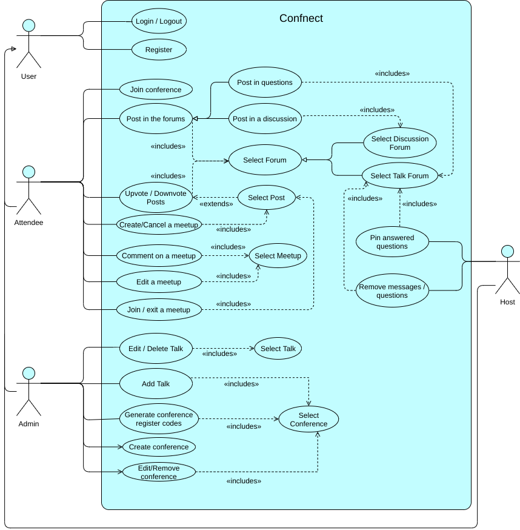

#### Register

- **Actor**: Conference Attendee
- **Description**: In order to use the app, the user must create an account. To do so, he inserts his required personal information and chooses an username and password in the register screen.
- **Preconditions and Postconditions**: In order to be able to register, the user must have the app installed in his device.
- **Normal flow**
    - The user goes to the register screen
    - The user fills the form with valid information
    - The user is then registered and automatically logged in by the system
- **Alternative Flows and Exceptions**
    - The user goes to the register
    - The user fills the form with invalid information
    - The user is not registered by the system

#### Login

- **Actor**: Conference Attendee
- **Description**: In order to use the app, the user must be autheticated. To do so, he inserts his valid credentials (username and password) in the login screen.
- **Preconditions and Postconditions**: In order to be able to login, the user must have previously registered.
- **Normal flow**
    - The user goes to the login screen
    - The user inserts his valid credentials
    - After validating the credentials, the user is logged in by the system
- **Alternative Flows and Exceptions**
    - The user goes to the login screen
    - The user inserts invalid credentials
    - The user is not logged in by the system


#### Join Conference

- **Actor**: Conference Attendee
- **Description**: The user must join a conference, in order to have the full app experience. To do so, he needs the conference code he obtained after signing up to the physical conference.
- **Preconditions and Postconditions**: The user must be logged in. After joining a conference, the user can enter the conference space.
- **Normal flow**
    - The user clicks on the add conference button
    - The user inserts his valid conference code
    - After validating the conference code, the user is registered in the conference and the talks he's attending by the system
- **Alternative Flows and Exceptions**
    - The user clicks on the add conference button
    - The user inserts an invalid conference code
    - The conference code is not validated by the system, therefore the user is not registered in a conference


#### Post in the forums

- **Actor**: Conference Atendee
- **Description**: In order to be an active member, the user must be able to post in the forums. 'Post in questions' and 'post in a discussion' are special cases of this use case, because the forums are subdivided in talk (questions) and topic (discussion) forums. 
- **Preconditions and Postconditions**: In order to post the user must be logged in and registered in the conference. For posting in questions, the user must be registered in the talk. The user must also select a forum to post in. Then the post is added to the forum.
- **Normal Flow**:
    - The ateendee goes to the forum
    - The atendee presses the button to add a post
    - The atendee types his post
    - If it's within the allowed length, the system saves the question, and displays it on the forum
- **Alternative Flows and Exceptions**
    - The ateendee goes to the forum
    - The atendee presses the button to add a post
    - The atendee types his question
    - If the post is too long, the system does not allow to publish the post


#### Up/Downvote Questions

- **Actor**: Conference Atendee
- **Description**: The users are able to participate in which posts are considered 'good' or 'bad' by clicking either the upvote or downvote button in a post or forum.
- **Preconditions and Postconditions**: The user must have logged in and selected a forum or post. Then he can press the upvote or downvote button.
- **Normal Flow**:
    - The atendee finds the post
    - The atendee presses the up/downvote question
    - The vote count is updated


#### Create a meetup

- **Actor**: Conference Atendee
- **Description**: This use case exists so that the attendees can meet other attendees with similiar interests. If a discussion is particularly interesting the user can create a meetup. He can also cancel it afterwards.
- **Preconditions and Postconditions**: The user must be logged in. He must also have selected a post. The user must have participated in the discussion to propose a meeting.
- **Normal Flow**:
    - The ateendee goes to the post
    - The atendee presses the button to create meetup
    - The atendee fills in some details, like the location and date and time of the meetup
    - The meetup is created.

- **Alternative Flows and Exceptions**
    - The ateendee goes to the post
    - The atendee presses the button to create meetup
    - If the attendee didn't participate in the discussion, a warning message appears

#### Cancel a meetup

- **Actor**: Conference Atendee
- **Description**: The user that created the meetup can also cancel it, in case no one was interesting or it won't be possible to gather.
- **Preconditions and Postconditions**: The user must be logged in. He must also have selected a post. To cancel the meeting, the user must have created it.
- **Normal Flow**:
    - The ateendee goes to the post
    - The atendee presses the button to cancel
    - The meetup is canceled

- **Alternative Flows and Exceptions**
    - The ateendee goes to the post
    - The cancel button doesn't appear because the user didn't create the meetup


#### Comment on a meetup

- **Actor**: Conference Atendee
- **Description**: This use case exists so that attendees that participate in the given discussion can comment on its meetup so they can plan the meeting.
- **Preconditions and Postconditions**: The user must be logged in. The user must have participated in the discussion to comment on the meetup. The meetup must have already been created.
- **Normal Flow**:
    - The atendee opens the meetup
    - The attendee writes his message
    - His comment is created and appears

- **Alternative Flows and Exceptions**
    - The attendee opens the meetup
    - The attendee didn't participate in the discussion
    - The attendee can't comment on the meetup

    - The ateendee opens the meetup
    - The attendee writes an invalid message (excess characters)
    - An error message appears and the comment is not created


#### Edit a meetup

- **Actor**: Conference Atendee
- **Description**: This use case exists so that if from the meetup's comments there is a need for a change, like the meetup place or date and time, the creator can alter them to the desired ones.
- **Preconditions and Postconditions**: The user must be logged in. The meetup must have already been created. The user be the creator of the meetup. 
- **Normal Flow**:
    - The user opens the meetup
    - The user clicks in the edit button
    - He fills in the form with the new details
    - The meetup is changed

- **Alternative Flows and Exceptions**
    - The attendee opens the meetup
    - The attendee isn't the meetup creator
    - The attendee can't edit the meetup

    - The ateendee opens the meetup
    - The attendee writes an invalid message (example: excess characters)
    - An error message appears and the comment is not created


#### Join a meetup

- **Actor**: Conference Atendee
- **Description**: The attendee can join a meetup, if he feels interested in meeting the people he has discussed it. 
- **Preconditions and Postconditions**: The user must be logged in. The meetup must have already been created. The user must have participated in the discussion.
- **Normal Flow**:
    - The user opens the post
    - The user clicks in the join meetup button
    - The user joined the meetup

- **Alternative Flows and Exceptions**
    - The attendee opens the meetup
    - The attendee didn't participate in the discussion
    - The attendee can't join the meetup


#### Exit a meetup

- **Actor**: Conference Atendee
- **Description**: The attendee can exit a meetup, if he no longer feels like going or something showed up.
- **Preconditions and Postconditions**: The user must be logged in. The meetup must have already been created. The user must have have joined the meetup.
- **Normal Flow**:
    - The user opens the post
    - The user clicks in the exit meetup button
    - The user exited the meetup

- **Alternative Flows and Exceptions**
    - The attendee opens the meetup
    - The attendee didn't join the meetup
    - The attendee can't press the exit meetup button


#### Create a conference

- **Actor**: Administrator
- **Description**: The administrator should be able to create a new conference, because without conferences, there is no functionality.
- **Preconditions and Postconditions**: The user must be logged in. After the user creates the conference, he automatically becomes its administrator.
- **Normal Flow**:
    - The user is in the conference selection page and clicks the create conference button
    - The user fills the form that appears with valid conference info
    - The conference is created by the system

- **Alternative Flows and Exceptions**
    - The user is in the conference selection page and clicks the create conference button
    - The user fills the form that appears with invalid conference info
    - The conference is not created


#### Edit Conference

- **Actor**: Administrator
- **Description**: The administrator must be able to edit the conference details, if he needs to. For that, he opens the conference selection menu and clicks on the edit conference button. 
- **Preconditions and Postconditions**: The user must be logged in. The conference must already been created. The user must have created the conference.
- **Normal Flow**:
    - The user is in the conference selection page and clicks the edit conference button
    - The user fills the form that appears with valid conference info
    - The conference is edited by the system

- **Alternative Flows and Exceptions**
    - The user is in the conference selection page and clicks the edit conference button
    - The user fills the form that appears with invalid conference info
    - The conference is not edited


#### Remove Conference

- **Actor**: Administrator
- **Description**: The administrator must be able to delete the conference.
- **Preconditions and Postconditions**: The user must be logged in. The conference must already been created. The user must have created the conference.
- **Normal Flow**:
    - The user is in the conference selection page and clicks the delete conference button
    - A confirmation popup appears
    - The user confirms
    - The conference is edited by the system

- **Alternative Flows and Exceptions**
    - The user is in the conference selection page and clicks the delete conference button
    - A confirmation popup appears
    - The user cancels
    - The conference is not edited by the system


#### Add talk

- **Actor**: Administrator
- **Description**: This use case exists so that the Administrator is able to add the talks that the conference will have. He must have already selected the conference.
- **Preconditions and Postconditions**: The user has to be logged in and have admin privileges. He must have already selected the conference.
- **Normal Flow**:
    - The user is in the conference's talk administration page
    - The user clicks the add talk button
    - A form shows up and the user fills it with valid data
    - The talk is created
    
- **Alternative Flows and Exceptions**
    - The user is in the conference's talk administration page
    - The user clicks the add talk button
    - A form shows up and the user fills it with invalid data
    - The talk is not created


#### Edit talk

- **Actor**: Administrator
- **Description**: The conference admin must be able to edit a given talk.
- **Preconditions and Postconditions**: The user has to be logged in and have admin privileges. He must have already selected the conference and the talk to edit.
- **Normal Flow**:
    - The user is in the conference's talk administration page
    - The user clicks the edit talk button
    - A form shows up and the user fills it with valid data
    - The talk is edited
    
- **Alternative Flows and Exceptions**
    - The user is in the conference's talk administration page
    - The user clicks the edit talk button
    - A form shows up and the user fills it with invalid data
    - The talk is not edited


#### Remove talk

- **Actor**: Administrator
- **Description**: The conference admin must be able to remove a given talk.
- **Preconditions and Postconditions**: The user has to be logged in and have admin privileges. He must have already selected the conference and the talk to remove.
- **Normal Flow**:
    - The user is in the conference's talk administration page
    - The user clicks the remove talk button
    - A confirmation popup shows up and the user confirms
    - The talk is removed
    
- **Alternative Flows and Exceptions**
    - The user is in the conference's talk administration page
    - The user clicks the remove talk button
    - A confirmation popup shows up and the user cancels
    - The talk is not removed


#### Generate conference register codes

- **Actor**: Administrator
- **Description**: The conference admin must be able to generate a conference code, that will be used by other users to join the conference and the talks they are registered in.
- **Preconditions and Postconditions**: The user has to be logged in and have admin privileges. He must have already selected the conference.
- **Normal Flow**:
    - The user is in the conference's code administration page
    - The user clicks the add code button
    - A new page shows up that lets the user select the talks that the code will give access to
    - The user selects talks
    - The code is created
    
- **Alternative Flows and Exceptions**
    - The user is in the conference's code administration page
    - The user clicks the add code button
    - A new page shows up that lets the user select the talks that the code will give access to
    - The user cancels
    - The code is not created


#### Pin answered questions
- **Actor**: Talk Host
- **Description**: This use case exists so talk hosts can flag good answers to questions.
- **Preconditions and Postconditions**: The host has to be logged in. The answer must already exist and if he pins the answer, it will be the only pinned answer in the post.
- **Normal Flow**:
    - The host chooses a question
    - The host answers the question
    - He can press the button to pin the response
    - The response will be the first to appear and highlited
    

#### Remove messages / questions
- **Actor**: Host
- **Description**: This use case exists so that the Host of the talk is able to delete messages that are not relevant or inaproprite from their talk forum.
- **Preconditions and Postconditions**: The user has to be the host of the respective talk. The question will then be removed from the database.
- **Normal Flow**:
    - The user goes to a post in the talk forum
    - The user has the host role
    - The user clicks delete
    - The system deletes the talk
    
- **Alternative Flows and Exceptions**
    - The user goes to a post in the talk forum
    - If they do not have the host status in the talk, they wont be presented with the option to delete the post


### User stories

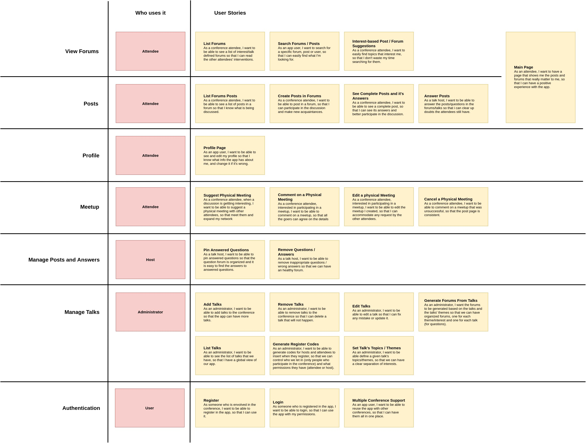

#### Login Screen
<p>
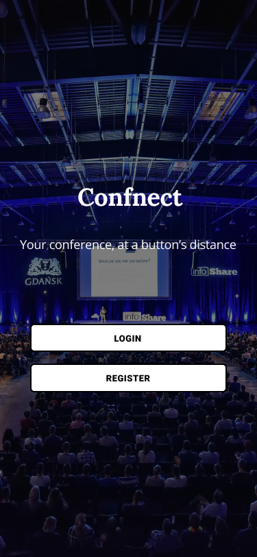
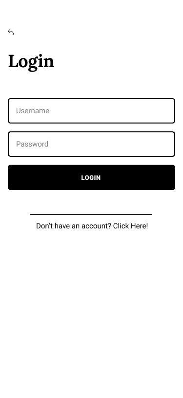
</p>
As someone who is envolved in the conference, I want to be able to register in the app, so that I can use it.

    
##### Value and Effort
    - Value: Must have.
    - Effort: S

##### Acceptance Tests

```gherkin
Scenario: Registering in app
  Given There are 2 Users registered
  When I tap the "Register" button
  Then A form appears
  When the user fills the form correctly with a new username
  Then the user becomes registered and is redirected to the home page
  
Scenario: Registering in app
  Given There are 2 Users registered
  When I tap the "Register" button
  Then A form appears
  When the user fills the form correctly with an existin username
  Then an error message appears
  
Scenario: Registering in app
  Given There are 2 Users registered
  When I tap the "Register" button
  Then A form appears
  When the user fills the form incorrectly
  Then an error message appears
```

#### Register Screen

<p>
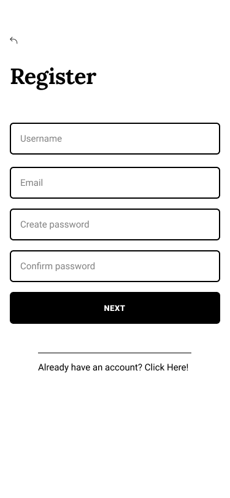
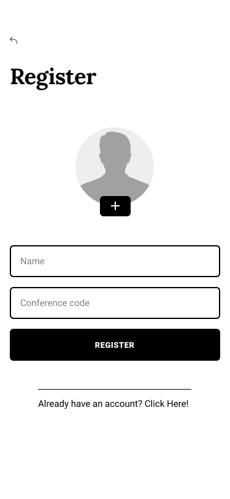
</p>

As someone who is registered in the app, I want to be able to login, so that I can use the app with my permissions.

##### Value and Effort
    -  Value: Must have.
    -  Effort: XS
##### Acceptance Tests

```gherkin
Scenario: Login
  Given There are 2 Users registered
  When I tap the "Login" button
  Then A form appears
  When the user fills the form correctly
  Then the user becomes Logged in and is redirected to the home page
  
  
Scenario: Login
  Given There are 2 Users registered
  When I tap the "Login" button
  Then A form appears
  When the user fills the form incorrectly
  Then a Error message appears
```

#### List Forums

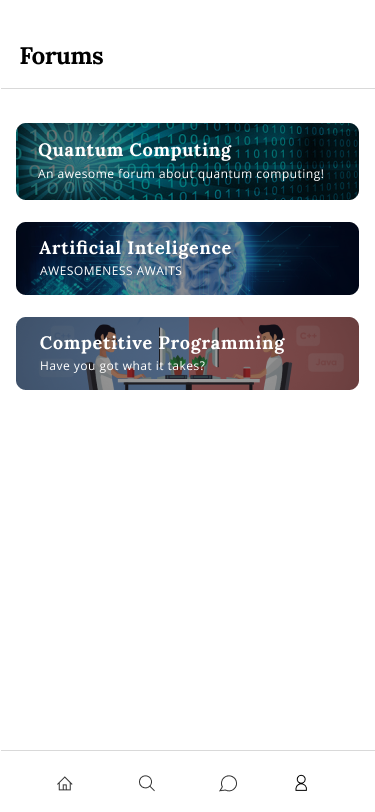

As a conference atendee, I want to be able to see a list of interest/talk defined forums so that I can read the other attendees' interventions.
##### Value and Effort
    - Value: Must have
    - Effort: M
##### Acceptance Tests

```gherkin
Scenario: Seeing list of forums
  Given the user is in the home page
  When I tap the "Forums" button
  Then a List of forums appears
```

#### List Forums Posts


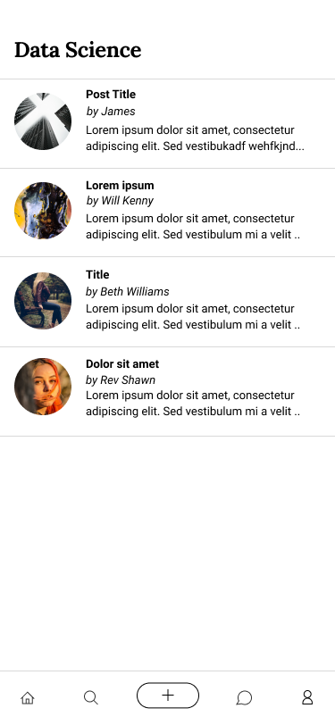

As a conference atendee, I want to be able to see a list of posts in a forum so that I know what is being discussed.
##### Value and Effort
    - Value: Must have
    - Effort: M
    
##### Acceptance Tests

```gherkin
Scenario: Seeing list of discussions
  Given the user is in the Forums page
  When I tap a specific forum
  Then a List of Discussions related to the forum appears
```

#### Profile Page

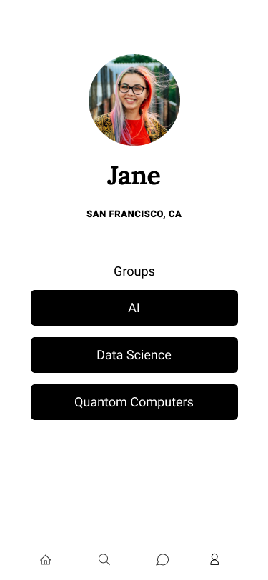

As an app user, I want to be able to see and edit my profile so that I know what info the app has about me, and change it if it's wrong.

##### Value and Effort
    - Value: Must have
    - Effort: M
##### Acceptance Tests
```gherkin
Scenario: Seeing my profile
  Given the user is in the home page
  When I tap the "Profile" button
  Then my profile appears
  
Scenario: Seeing my profile
  Given the user is his profile page
  When I tap the "Edit" button
  Then the user can change his personal info
  When the user updates his personal info correctly
  Then his profile is updated and he is redirected to his profile
  
Scenario: Seeing my profile
  Given the user is his profile page
  When I tap the "Edit" button
  Then the user can change his personal info
  When the user updates his personal info incorrectly
  Then an error appears and he is redirected to his profile
```


#### Create Posts in Forums


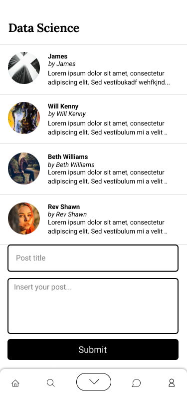

As a conference atendee, I want to be able to post in a forum, so that I can participate in the discussion and make new acquaintances.
##### Value and Effort
    - Value: Must have
    - Effort: S
##### Acceptance Tests

```gherkin
Scenario: Posting a discussion
  Given There are 3 posts in a forum
  When I tap the "add post" button
  And I submit the post with title and text
  Then There are 4 posts in the forum asked
  
Scenario: Posting a discussion
  Given There are 3 posts in a forum
  When I tap the "add post" button
  And I submit the post without title and/or text
  Then An error message appears
```

#### List Talks 

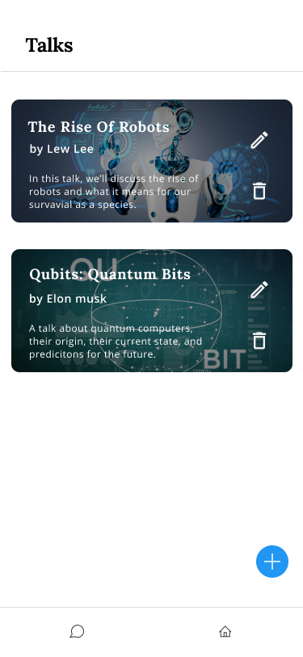

As an administrator, I want to be able to see the list of talks that we have, so that I have a global view of our app.
##### Value and Effort
    - Value: Must have
    - Effort: M
##### Acceptance Tests
```gherkin
Scenario: Seeing all talks
  Given the user is in the Talks page
  Then I can see all the talks and related buttons
```

#### Add Talks

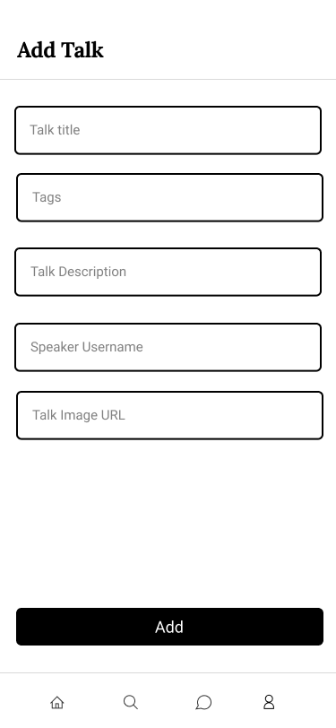

As an administrator, I want to be able to add talks to the conference so that the app can have more talks.
##### Value and Effort
    - Value: Must have
    - Effort: M
##### Acceptance Tests
```gherkin
Scenario: Adding a talk
    Given There is 1 talk
    When An administrator clicks on "add talk" button
    And Submits a talk with title, tags, description, sepaker and image
    Then There are 2 talks
    
Scenario: Adding a talk
    Given There is 1 talk
    When An administrator clicks on "add talk" button
    And Submits a talk with an error
    Then An error message appears
```

#### Set Talk's Topics / Themes

<p>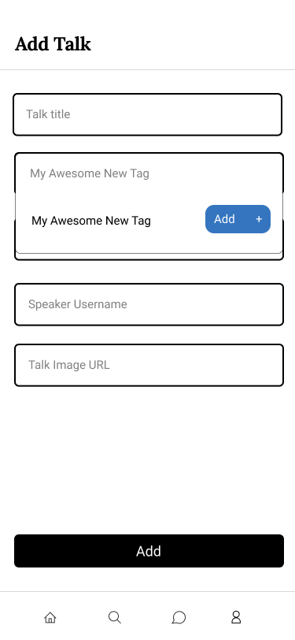
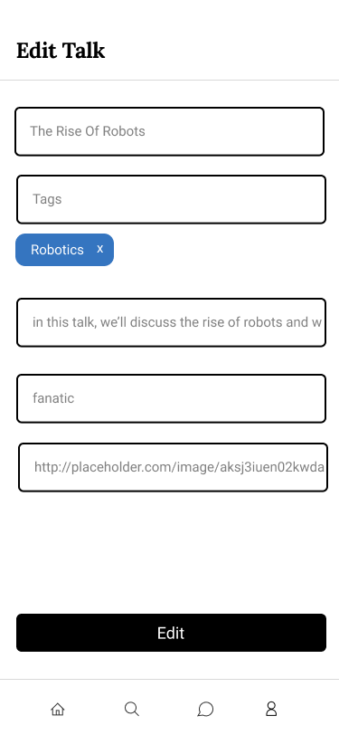</p>

As an administrator, I want to be able define a given talk's topics/themes, so that we can have a clear separation of interests.
##### Value and Effort
    - Value: Must have
    - Effort: M
##### Acceptance Tests
```gherkin
Scenario: The add talk page is opened
    Given There exists the tag "AI" in the database
    When An administrator clicks on "tags" field
    And Selects the tag "AI"
    Then That tag is added to the talk
    
Scenario: The add talk page is opened
    Given There are no tags in the database
    When An administrator clicks on the "tags" field
    And Starts typing a new tag name
    Then a "Add new tag" button appears
    
Scenario: The administrator starts typing on the "tags" and an "add new tag" button shows up on the screen
    Given There are not tags in the database
    When An administrator clicks on the "add new tag button"
    Then A new tag with the name that the administrator typed exists in the database
```

#### See Complete Post and it's Answers

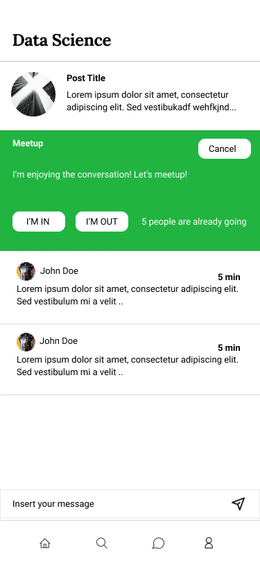

As a conference attendee, I want to be able to see a complete post, so that I can see its answers and better participate in the discussion.
##### Value and Effort
    - Value: Must have
    - Effort: M
##### Acceptance Tests
```gherkin
Scenario: Viewing a post
    Given There are 3 posts on a talk
    When I click on 1 post
    Then I am redirected to the post page which has its answers
```


#### Edit Talks


As an administrator, I want to be able to edit a talk so that I can fix any mistake or update it.
##### Value and Effort
    - Value: Must have
    - Effort: M
##### Acceptance Tests
```gherkin
Scenario: Editing a talk
    Given There is 1 talk
    When An administrator clicks on "edit talk" button from 1 talk
    And Changes one or more parts 
    Then The talk is changed
```

#### Remove Talks

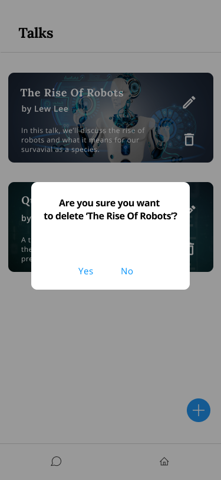

As an administrator, I want to be able to remove talks to the conference so that I can delete a talk that will not happen.
##### Value and Effort
    - Value: Must have
    - Effort: S
##### Acceptance Tests
```gherkin
Scenario: Removing a talk
    Given There are 2 talk
    When An administrator clicks on "remove talk" button from 1 talk
    And Confirms the deletion
    Then There is 1 talk

Scenario: Removing a talk
    Given There are 2 talk
    When An administrator clicks on "remove talk" button from 1 talk
    And Doesn't confirms the deletion
    Then There are 2 talk
```


#### Answer Posts / Questions


As a talk host, I want to be able to answer the posts/questions in the forums/talks so that i can clear up doubts the attendees still have.
##### Value and Effort
    - Value: Must have
    - Effort: M
##### Acceptance Tests
```gherkin
Scenario: Adding a comment
  Given Post A has 2 comments and I have the 'host' role
  When I tap the "add comment" button
  And I submit a comment "My answer is this"
  Then Post A has 3 comments
  And Post A contains a comment "My answer is this"
  And Post A contains a pinned comment "My answer is this"
```


#### Suggest Physical Meeting
<p>

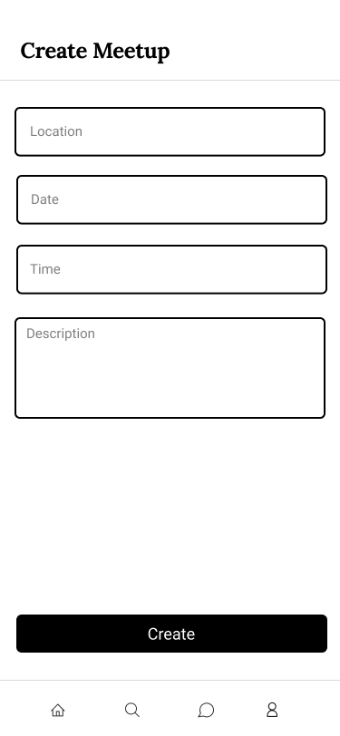
</p>

As a conference attendee, when a discussion is gettting interesting, I want to be able to suggest a physical meeting with other attendees, so that meet them and expand my network.
    - Value: Must have
    - Effort: M
##### Acceptance Tests
```gherkin
Scenario: Creating a meetup
  Given Post A has no meetup in progress
  When I tap the "Meetup" button
  And I fill in the form with the meetup location, date, time and description
  Then Post A has a meetup in progress
  And The meetup has the details I inserted in the form
 
Scenario: Creating a meetup
  Given Post A has no meetup in progress
  When I tap the "Meetup" button
  And I don't fill in the form correctly
  Then Post A has no meetup in progress
  And An error message appears
```

#### Comment on a Physical Meeting

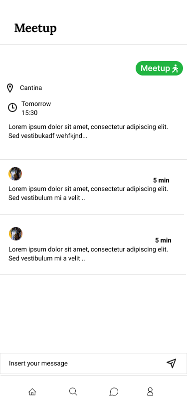

As a conference attendee, interested in participating in a meetup, I want to be able to comment on a meetup, so that all the goers can agree on the details.

##### Value and Effort
    - Value: Must have
    - Effort: S
##### Acceptance Tests
```gherkin
Scenario: In the Meetup page, adding a comment
  Given The Meetup has no comments
  When I tap the "add comment" button
  And I submit a comment "My answer is this"
  Then The Meetup has one comment
  And The Meetup contains a comment "My answer is this"
```

#### Edit a Physical Meeting

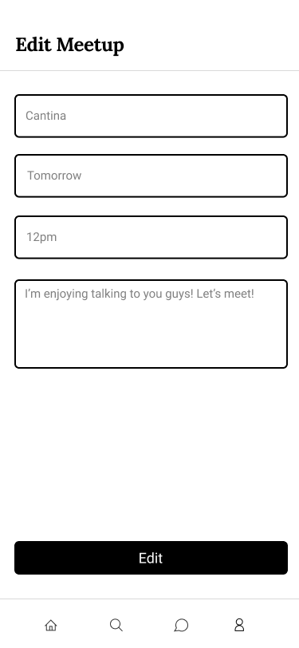

As a conference attendee, interested in participating in a meetup, I want to be able to edit the meetup I created, so that I can accommodate any request by the other attendees.

##### Value and Effort
    - Value: Must have
    - Effort: S
##### Acceptance Tests
```gherkin
Scenario: Editing the meetup
    Given There is 1 meetup and I am the meetup creator
    When I click on the "edit meetup" button
    And Change one or more details 
    Then The meetup details are changed accordingly
Scenario: Editing the meetup
    Given There is 1 meetup and I am the meetup creator
    When I click on the "edit meetup" button
    And Fill the form incorrectly
    Then The meetup details are not changes
    And An error occurs
```

#### Cancel a Physical Meeting

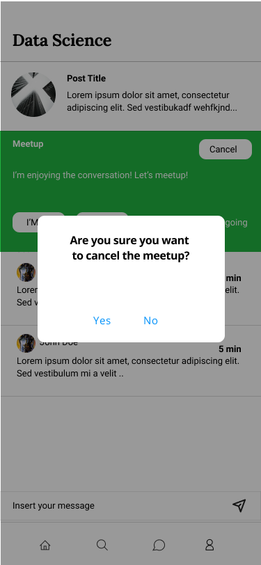

As a conference attendee, I want to be able to comment on a meetup that was unsuccessful, so that the post page is consistent.

##### Value and Effort
    - Value: Must have
    - Effort: S
##### Acceptance Tests
```gherkin
Scenario: In the Post page
  Given There is 1 meetup and I am the meetup creator
  When I tap the "delete meetup" button
  And I Give confirmation
  Then There is no meetups
Scenario: In the Post page
  Given There is 1 meetup and I am the meetup creator
  When I tap the "delete meetup" button
  And I don't Give confirmation
  Then There is 1 meetup
```

#### Search Page

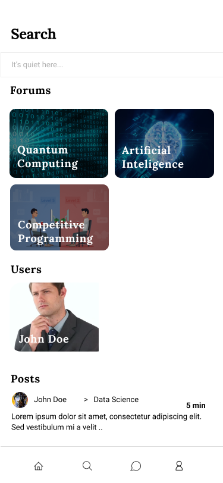

As an app user, I want to search for a specific forum, post or user, so that I can easily find what I'm looking for.

##### Value and Effort
    - Value: Must have
    - Effort: M 
##### Acceptance Tests
```gherkin
Scenario: In the Search page
    Given There exists many forums, users and posts
    When I write something in the "search field"
    Then The forums, users and posts that resemble what I wrote the most show up
```


#### Interest-based Post / Forum Suggestions
    
As a conference attendee, I want to easily find topics that interest me, so that I don't waste my time searching for them.
##### Value and Effort
    - Value: Could have
    - Effort: M
##### Acceptance Tests
```gherkin
    TODO
```


#### Main Page

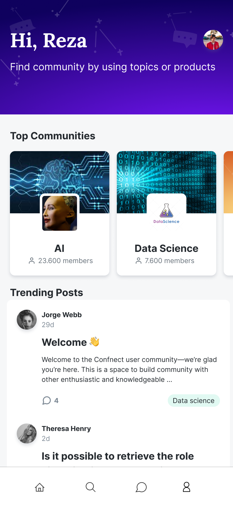

As an attendee, I want to have a page that shows me the posts and forums that really matter to me, so that I can have a positive experience with the app.
##### Value and Effort
    - Value: Must have
    - Effort: M
##### Acceptance Tests

```gherkin
    TODO
```


#### Generate Forums From Talks
*Note: this is made automatically whenever a talk is added, so there is no mockup*<br/>
As an administrator, I want the forums to be generated based on the talks and the talks' themes so that we can have organized forums, one for each theme/interest and one for each talk (for questions).
##### Value and Effort
    - Value: Must have
    - Effort: S
##### Acceptance Tests
```gherkin
    TODO
```

#### Remove Questions / Answers

As a talk host, I want to be able to remove inappropriate questions / wrong answers so that we can have an healthy forum.
##### Value and Effort
    - Value: Must have.
    - Effort: S
##### Acceptance Tests
```gherkin
    TODO
```

#### Pin Answered Questions

As a talk host, I want to be able to pin answered questions so that the question forum is organized and it is easy to find the answers to answered questions.
##### Value and Effort
    - Value: Could have
    - Effort: S
##### Acceptance Tests
```gherkin
    TODO
```

#### Generate Register Codes

As an administrator, I want to be able to generate codes for hosts and attendees to insert when they register, so that we can control who we let in (only people who participate in the conference) and what permissions they have (attendee or host).
##### Value and Effort
    - Value: Could have
    - Effort: M
##### Acceptance Tests
```gherkin
    TODO
```

#### Multiple Conference Support

As an administrator, I want to be able to reuse the app with other conferences, so that we take good value from the investment.

##### Value and Effort
    - Value: Could Have
    - Effort: M
##### Acceptance Tests
```gherkin
    TODO
```


### Domain model

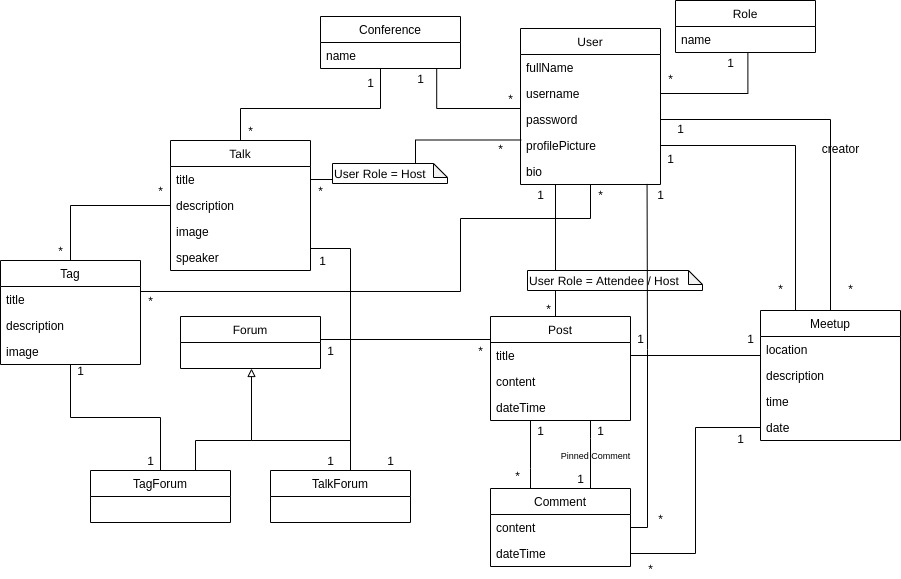

---

## Architecture and Design


### Logical architecture


### Physical architecture


---

## Implementation

### Product increment #1

For this iteration we implemented the [login](#login-screen), [register](#register-screen) and [forum list](#list-forums) pages. <br/>Release: [v0.1](https://github.com/FEUP-ESOF-2020-21/open-cx-t7g2-hamelin-flutters/releases/tag/v0.1).

### Product increment #2

For this iteration we implemented:
- [List forum posts](#list-forums-posts)
- [List talks](#list-talks)
- [Add talks](#add-talks)
- [Set talk's topics/themes](#set-talks-topics--themes)
- [Create posts in forums](#create-posts-in-forums)
- [Remove talks](#remove-talks)
- [See complete post and its answers](#see-complete-posts-and-its-answers)
- [Answer posts / Questions](#answer-posts--questions)

Release: [v0.2](https://github.com/FEUP-ESOF-2020-21/open-cx-t7g2-hamelin-flutters/releases/tag/v0.2).

### Product increment #3

For this iteration we implemented:
- [Profile Page](#profile-page)
- [Edit talks](#edit-talks)
- [Host answers posts/questions and has answer pinned](#answer-posts--questions)
- [Suggest Physical Meeting](#suggest-physical-meeting)
- [Comment on a Physical Meeting](#comment-on-a-physical-meeting)
- [Search page](#search-page)
- [Interest-based Post / Forum Suggestions](#interest-based-post--forum-suggestions)
- [Main Page](#main-page)
- [Generate Forums From Talks](#generate-forums-from-talks)

Release: [v0.3](https://github.com/FEUP-ESOF-2020-21/open-cx-t7g2-hamelin-flutters/releases/tag/v0.3).

---
## Test

 


---
## Configuration and change management

[GitHub flow](https://guides.github.com/introduction/flow/).


---

## Project management


---

## Evolution - contributions to open-cx

