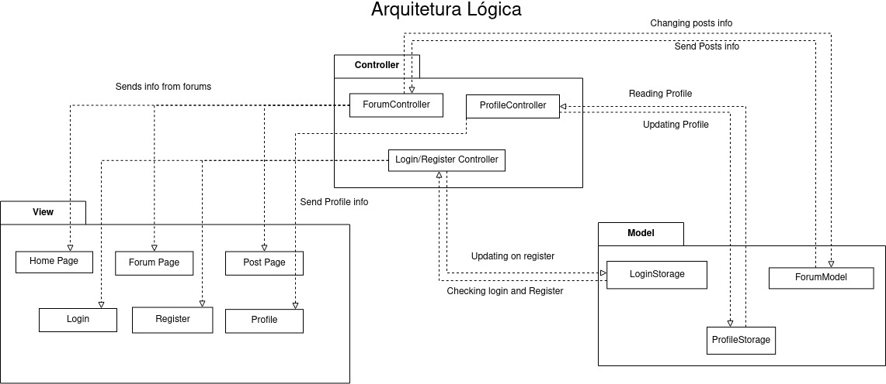
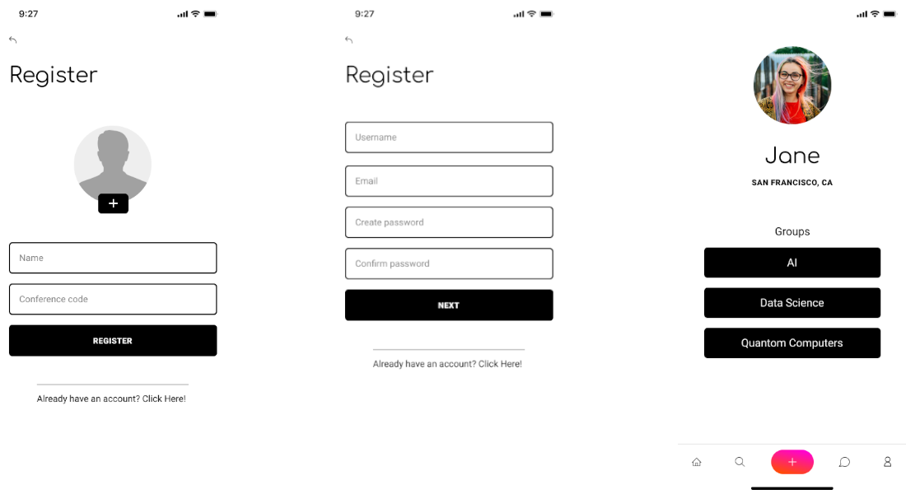
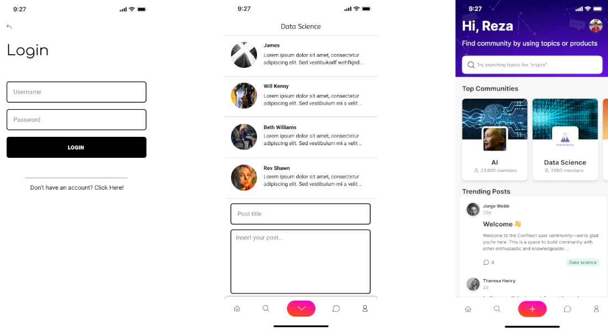
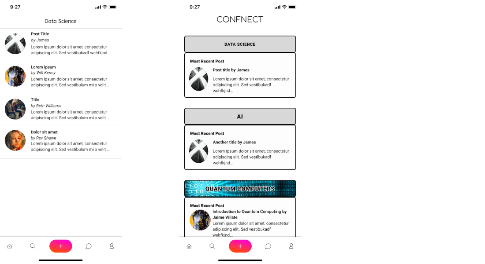

# Hamelin Flutters

## Confnect

- João Rocha
- João Romão
- Rafael Cristino
- Tiago Alves
- Xavier Pisco

## Product Vision

Connecting people through ideas, beyond the conference.

## Elevator Pitch

Our goal is to connect conference goers, making them discuss and talk beyond the conference. By using our app, Confnect, the users will be added to different forums, depending on their interests and on the attended talks, encouraging them to ask questions, discuss and meet with people with similar interests. The app includes many types of forums, including a sub-forum for each talk, in which the speaker can answer all the questions of the attendees after the talk, and some main forums, separated by theme, in which users can create their own discussions. During the conference users with similar interests will be motivated to meet up, creating a more united conference.

<!--* Recomendar discussões baseadas nas palestras a que pessoa vai/foi, associando as discussões a interesses (tópicos genéricos) e depois recomendando as discussões sobre esses interesses. Podem ser também recomendados à pessoa outros participantes, que participem nas mesmas discussões ou tenham os mesmos interesses (vão à mesma palestra).
* Threads de dúvidas com o palestrante apenas com pessoas que foram à palestra
* O objetivo é causar uma conexão física, logo ao fim de algum tempo de discussão é sugerido um 'meet up'. E a discussão teria lá um botão de 'meet up' que quando fosse clicado criava tipo uma prompt para as pessoas que estão interessadas.
* Poderia fazer-se os dois, criar uma thread para cada palestra, de modo ao palestrante reponder, mas essa palestra tambem ser associada a um tema/interesse, onde as pessoas poderiam crias as suas proprias duvidas.

> Não podia estar organizado assim? (+rep)
    > |-aplicação
        > Sugestões
        > |- Tema da thread (AI, data science...)
            > |- Thread global
            > |- Diferentes palestras-->

## Requirements

### Use case diagram 

#### Post in questions

- **Actor**: Conference Atendee
- **Description**: This use case exists so that the atendees can upload their questions into the database to later be answered by the host of the talk
- Preconditions and Postconditions: In order to post a question the user must be enlisted in the respective talk and be logged in. The questions will be uploaded on the respective forum.
- **Normal Flow**:
    - The ateendee goes to the talk forum
    - The atendee presses the button to add a question to a forum
    - The atendee types his question
    - If it's within the allowed length, the system saves the question to the database, and displays it on the forum.
- **Alternative Flows and Exceptions**
    - The ateendee goes to the talk forum
    - The atendee presses the button to add a question to a forum
    - The atendee types his question
    - If the question is too long, the system does not allow to post the question

#### Post in discussion

- **Actor**: Conference Atendee
- **Description**: This use case exists so that the atendees can post discussions in different forums, so people are able to talk and discuss different themes.
- Preconditions and Postconditions: In order to like and dislike, the user must be a member of the current forum and be logged in. The vote cout will be updated 
- **Normal Flow**:
    - The ateendee goes to the talk forum
    - The atendee presses the button to add a new post to the forum
    - The atendee types his post
    - If it's within the allowed length, the system saves the post to the database, and displays it on the forum.
- **Alternative Flows and Exceptions**
    - The ateendee goes to the talk forum
    - The atendee presses the button to add a new post to the forum
    - The atendee types his post
    - If the post is too long, the system does not allow to post the question

#### Up/Downvote Questions

- **Actor**: Conference Atendee
- **Description**: This use case exists so that the questions are ordered by number of likes and to show the most relevant questions
- Preconditions and Postconditions: In order to post a question the user must be enlisted in the respective talk. The questions will be uploaded on the respective forum.
- **Normal Flow**:
- 
    - The atendee finds the post
    - The atendee presses the up/downvote question
    - The vote count is updated

#### Set up a meeting in real life
- **Actor**: Conference Atendee
- **Description**: This use case exists so that the atendees can meet other ateendes with similiar interests, if a discussion is particulary interesting the user can propose to meet up in real life, and the other users can either accept or deny the request.
- Preconditions and Postconditions: An ateendee must have participated in the discussion to propose a meeting. All the other member will recieve a notfication to meet up.
- **Normal Flow**:
    - The ateendee goes to the post
    - The atendee presses the button to add meetup in real life
    - The atendee answers the form on where and when the meeting will occur
    - The other members of the discussion will recieve a notification to go to the meetup
    - If the user participated in the discussion the other members will be notified of the meetup.
- **Alternative Flows and Exceptions**
    - The ateendee goes to the post
    - The atendee presses the button to add meetup in real life
    - If the atendee did not participate in the discussion, an error message appears.

#### Add, Edit and Delete a talk
- **Actor**: Administrator
- **Description**: This use case exists so that the Administrator is able to add the talks that the conference will have, and edit and deleted them if there is some alteration.
- Preconditions and Postconditions: The host has to be logged in and have admin privileges. The talk will be added, eddited or deleted from the database.
- **Normal Flow**:
    - The Admin chooses a talk
    - If the admin is logged in and has admin status, they can signall the system to add/remove/edit.
    - The system updates the database.
    
- **Alternative Flows and Exceptions**
    - The Admin chooses a talk
    - If they do not have the admin status, they wont be presented with the option to add/edit/delete the talk.

#### Pin answered questions
- **Actor**: Talk Host
- **Description**: This use case exists so talk hosts can flag questions as having received a satisfactory answer.
- Preconditions and Postconditions: The host has to be logged in, and if he pins the question, the question will be marked as answered. (E movida para outra pagina?)
- **Normal Flow**:
    - The host chooses a question
    - The host answers the question
    - He can press the button to pin the response
    - The response will be the first to appear and highlited
    

#### Delete a Question
- **Actor**: Host
- **Description**: This use case exists so that the Host of the talk is able to delete questions that are not relevant or inaproprite from their talk
- Preconditions and Postconditions: The user has to be the host of the respective talk. The question will then be removed from the database.
- **Normal Flow**:
    - If the Host is logged in and is the host of the talk, they can signall the system to delete it.
    - The system updates the database.
    
- **Alternative Flows and Exceptions**
    - The Host goes to the talk forum
    - If they do not have the host status in the talk, they wont be presented with the option to elete the question.

### User stories

- As someone who is envolved in the conference, I want to be able to register in the app, so that I can use it.
    -  Value: Must have.
    -  Effort: S
- As someone who is registered in the app, I want to be able to login, so that I can use the app with my permissions.
    -  Value: Must have.
    -  Effort: XS

<!--    - As a conference attendee, I want to discuss with other ateendees about specific subjects so that I can make new acquaintances.
        - Value: Must have
        - Effort: XL
It is an epic! Split into smaller stories:-->

- As a conference atendee, I want to be able to see a list of interest/talk defined forums so that I can read the other attendees' interventions.
    - Value: Must have
    - Effort: M
- As a conference atendee, I want to be able to see a list of posts in a forum so that I know what is being discussed.
    - Value: Must have
    - Effort: S
- As a conference atendee, I want to be able to post in a forum, so that I can participate in the discussion and make new acquaintances.
    - Value: Must have
    - Effort: S
- As a talk host, I want to be able to answer the questions asked by the talk's attendees so that i can clear up doubts the atendees still have.
    - Value: Must have
    - Effort: M
- As a conference attendee, I want to be able to set up a physical meeting with other attendees, so that I can expand my network.
    - Value: Could have
    - Effort: L
- As a conference attendee, I want to easily find topics that interest me, so that I don't waste my time searching for them.
    - Value: Could have
    - Effort: L

- As a talk attendee, I want to be able to post and answer questions in the talk's forums, so that I can clarify any doubts that may come from it.
    - Value: Must Have
    - Effort: M
- As a talk host, I want to be able to pin answered questions so that the question forum is organized and it is easy to find the answers to answered questions.
    - Value: Could have
    - Effort: M
- As a talk host, I want to be able to remove inappropriate questions / wrong answers so that we can have an healthy forum.
    - Value:Could have.
    - Effort: S
- As an administrator, I want to be able to add, remove and edit talks to the conference so that the app is more organized.
    - Value: Must have
    - Effort: M
- As an administrator, I want to be able define a given talk's topics/themes, so that we can have a clear separation of interests.
    - Value: Must have
    - Effort: M
- As an administrator, I want the forums to be generated based on the talks and the talks' themes so that we can have organized forums, one for each theme/interest and one for each talk (for questions).
    - Value: Must have
    - Effort: M
- As an administrator, I want to be able to generate codes for hosts and attendees to insert when they register, so that we can control who we let in (only people who participate in the conference) and what permissions they have (attendee or host).
    - Value: Could have
    - Effort: S

### Domain model

---

## Architecture and Design

### Logical architecture

### Physical architecture

### Prototype

---

## Implementation

---
## Test

 

---
## Configuration and change management

[GitHub flow](https://guides.github.com/introduction/flow/).

---

## Project management

---

## Evolution - contributions to open-cx

