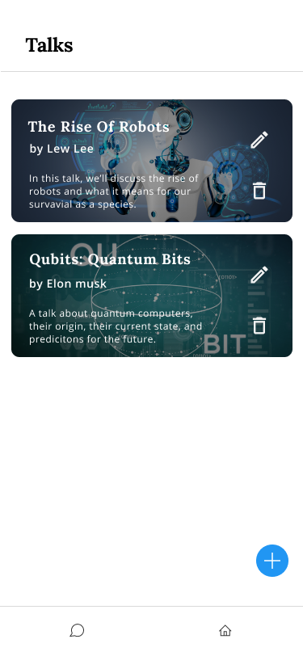
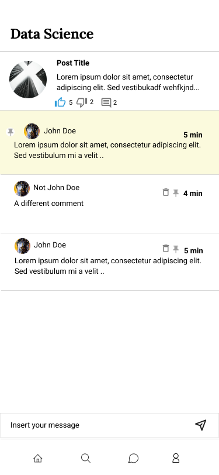
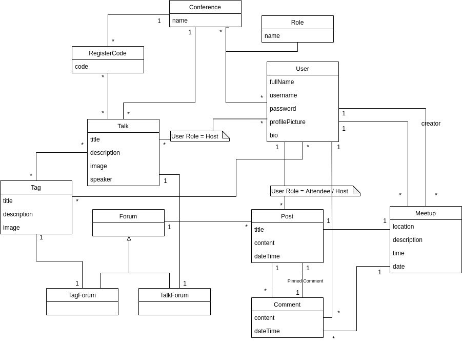
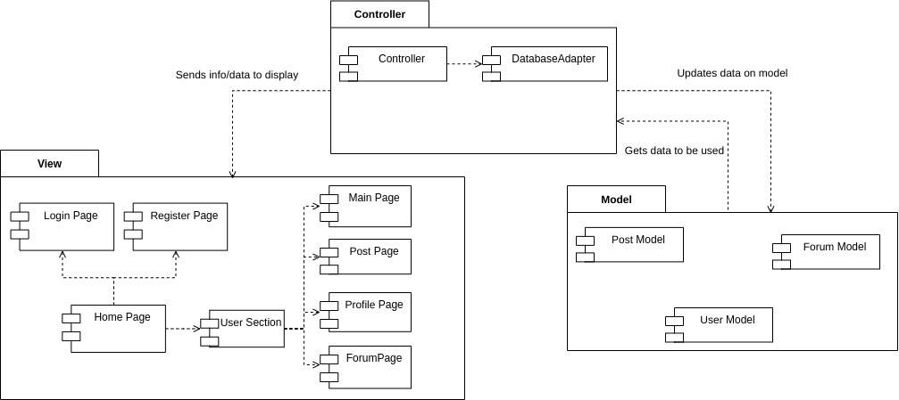
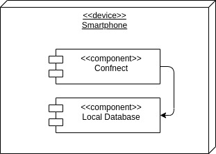
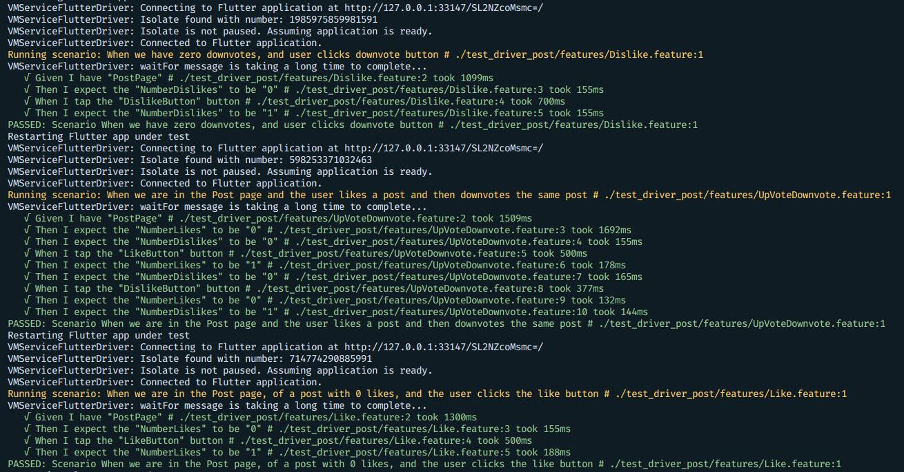

# Hamelin Flutters

## Confnect

- João Rocha
- João Romão
- Rafael Cristino
- Tiago Alves
- Xavier Pisco


## Product Vision

<!--Helping people burst their bubble by connecting them through ideas, beyond the conference.-->

Making conferences meaningful by connecting people, through interests and discussions, in order to create lifetime relations.

## Elevator Pitch

Our goal is to connect conference goers, helping them discuss and talk beyond the conference. By using our app, Confnect, the users will be added to different forums, depending on their interests and on the attended talks, encouraging them to ask questions, discuss and meet people with similar interests. The app includes many types of forums, including a sub-forum for each talk, in which the speaker can answer all the questions the attendees may have after the talk, and some main forums, separated by theme, where users can create their own discussions. Sure, other services like 'Reddit' allow users to discuss about various topics. But our product features an innovative functionality, which will motivate and help attendees with similar interests to physically meet up, creating a more united conference.


## Requirements

### Use case diagram 


#### Register

- **Actor**: Conference Attendee
- **Description**: In order to use the app, the user must create an account. To do so, he inserts his required personal information and chooses an username and password in the register screen.
- **Preconditions and Postconditions**: In order to be able to register, the user must have the app installed in his device.
- **Normal flow**
    - The user goes to the register screen
    - The user fills the form with valid information
    - The user is then registered and automatically logged in by the system
- **Alternative Flows and Exceptions**
    - The user goes to the register
    - The user fills the form with invalid information
    - The user is not registered by the system

#### Login

- **Actor**: Conference Attendee
- **Description**: In order to use the app, the user must be autheticated. To do so, he inserts his valid credentials (username and password) in the login screen.
- **Preconditions and Postconditions**: In order to be able to login, the user must have previously registered.
- **Normal flow**
    - The user goes to the login screen
    - The user inserts his valid credentials
    - After validating the credentials, the user is logged in by the system
- **Alternative Flows and Exceptions**
    - The user goes to the login screen
    - The user inserts invalid credentials
    - The user is not logged in by the system


#### Join Conference

- **Actor**: Conference Attendee
- **Description**: The user must join a conference, in order to have the full app experience. To do so, he needs the conference code he obtained after signing up to the physical conference.
- **Preconditions and Postconditions**: The user must be logged in. After joining a conference, the user can enter the conference space.
- **Normal flow**
    - The user clicks on the add conference button
    - The user inserts his valid conference code
    - After validating the conference code, the user is registered in the conference and the talks he's attending by the system
- **Alternative Flows and Exceptions**
    - The user clicks on the add conference button
    - The user inserts an invalid conference code
    - The conference code is not validated by the system, therefore the user is not registered in a conference


#### Post in the forums

- **Actor**: Conference Atendee
- **Description**: In order to be an active member, the user must be able to post in the forums. 'Post in questions' and 'post in a discussion' are special cases of this use case, because the forums are subdivided in talk (questions) and topic (discussion) forums. 
- **Preconditions and Postconditions**: In order to post the user must be logged in and registered in the conference. For posting in questions, the user must be registered in the talk. The user must also select a forum to post in. Then the post is added to the forum.
- **Normal Flow**:
    - The ateendee goes to the forum
    - The atendee presses the button to add a post
    - The atendee types his post
    - If it's within the allowed length, the system saves the question, and displays it on the forum
- **Alternative Flows and Exceptions**
    - The ateendee goes to the forum
    - The atendee presses the button to add a post
    - The atendee types his question
    - If the post is too long, the system does not allow to publish the post


#### Up/Downvote Questions

- **Actor**: Conference Atendee
- **Description**: The users are able to participate in which posts are considered 'good' or 'bad' by clicking either the upvote or downvote button in a post or forum.
- **Preconditions and Postconditions**: The user must have logged in and selected a forum or post. Then he can press the upvote or downvote button.
- **Normal Flow**:
    - The atendee finds the post
    - The atendee presses the up/downvote question
    - The vote count is updated


#### Create a meetup

- **Actor**: Conference Atendee
- **Description**: This use case exists so that the attendees can meet other attendees with similiar interests. If a discussion is particularly interesting the user can create a meetup. He can also cancel it afterwards.
- **Preconditions and Postconditions**: The user must be logged in. He must also have selected a post. The user must have participated in the discussion to propose a meeting.
- **Normal Flow**:
    - The ateendee goes to the post
    - The atendee presses the button to create meetup
    - The atendee fills in some details, like the location and date and time of the meetup
    - The meetup is created.

- **Alternative Flows and Exceptions**
    - The ateendee goes to the post
    - The atendee presses the button to create meetup
    - If the attendee didn't participate in the discussion, a warning message appears

#### Cancel a meetup

- **Actor**: Conference Atendee
- **Description**: The user that created the meetup can also cancel it, in case no one was interesting or it won't be possible to gather.
- **Preconditions and Postconditions**: The user must be logged in. He must also have selected a post. To cancel the meeting, the user must have created it.
- **Normal Flow**:
    - The ateendee goes to the post
    - The atendee presses the button to cancel
    - The meetup is canceled

- **Alternative Flows and Exceptions**
    - The ateendee goes to the post
    - The cancel button doesn't appear because the user didn't create the meetup


#### Comment on a meetup

- **Actor**: Conference Atendee
- **Description**: This use case exists so that attendees that participate in the given discussion can comment on its meetup so they can plan the meeting.
- **Preconditions and Postconditions**: The user must be logged in. The user must have participated in the discussion to comment on the meetup. The meetup must have already been created.
- **Normal Flow**:
    - The atendee opens the meetup
    - The attendee writes his message
    - His comment is created and appears

- **Alternative Flows and Exceptions**
    - The attendee opens the meetup
    - The attendee didn't participate in the discussion
    - The attendee can't comment on the meetup

    - The ateendee opens the meetup
    - The attendee writes an invalid message (excess characters)
    - An error message appears and the comment is not created


#### Edit a meetup

- **Actor**: Conference Atendee
- **Description**: This use case exists so that if from the meetup's comments there is a need for a change, like the meetup place or date and time, the creator can alter them to the desired ones.
- **Preconditions and Postconditions**: The user must be logged in. The meetup must have already been created. The user be the creator of the meetup. 
- **Normal Flow**:
    - The user opens the meetup
    - The user clicks in the edit button
    - He fills in the form with the new details
    - The meetup is changed

- **Alternative Flows and Exceptions**
    - The attendee opens the meetup
    - The attendee isn't the meetup creator
    - The attendee can't edit the meetup

    - The ateendee opens the meetup
    - The attendee writes an invalid message (example: excess characters)
    - An error message appears and the comment is not created


#### Join a meetup

- **Actor**: Conference Atendee
- **Description**: The attendee can join a meetup, if he feels interested in meeting the people he has discussed it. 
- **Preconditions and Postconditions**: The user must be logged in. The meetup must have already been created. The user must have participated in the discussion.
- **Normal Flow**:
    - The user opens the post
    - The user clicks in the join meetup button
    - The user joined the meetup

- **Alternative Flows and Exceptions**
    - The attendee opens the meetup
    - The attendee didn't participate in the discussion
    - The attendee can't join the meetup


#### Exit a meetup

- **Actor**: Conference Atendee
- **Description**: The attendee can exit a meetup, if he no longer feels like going or something showed up.
- **Preconditions and Postconditions**: The user must be logged in. The meetup must have already been created. The user must have have joined the meetup.
- **Normal Flow**:
    - The user opens the post
    - The user clicks in the exit meetup button
    - The user exited the meetup

- **Alternative Flows and Exceptions**
    - The attendee opens the meetup
    - The attendee didn't join the meetup
    - The attendee can't press the exit meetup button


#### Create a conference

- **Actor**: Administrator
- **Description**: The administrator should be able to create a new conference, because without conferences, there is no functionality.
- **Preconditions and Postconditions**: The user must be logged in. After the user creates the conference, he automatically becomes its administrator.
- **Normal Flow**:
    - The user is in the conference selection page and clicks the create conference button
    - The user fills the form that appears with valid conference info
    - The conference is created by the system

- **Alternative Flows and Exceptions**
    - The user is in the conference selection page and clicks the create conference button
    - The user fills the form that appears with invalid conference info
    - The conference is not created


#### Edit Conference

- **Actor**: Administrator
- **Description**: The administrator must be able to edit the conference details, if he needs to. For that, he opens the conference selection menu and clicks on the edit conference button. 
- **Preconditions and Postconditions**: The user must be logged in. The conference must already been created. The user must have created the conference.
- **Normal Flow**:
    - The user is in the conference selection page and clicks the edit conference button
    - The user fills the form that appears with valid conference info
    - The conference is edited by the system

- **Alternative Flows and Exceptions**
    - The user is in the conference selection page and clicks the edit conference button
    - The user fills the form that appears with invalid conference info
    - The conference is not edited


#### Remove Conference

- **Actor**: Administrator
- **Description**: The administrator must be able to delete the conference.
- **Preconditions and Postconditions**: The user must be logged in. The conference must already been created. The user must have created the conference.
- **Normal Flow**:
    - The user is in the conference selection page and clicks the delete conference button
    - A confirmation popup appears
    - The user confirms
    - The conference is edited by the system

- **Alternative Flows and Exceptions**
    - The user is in the conference selection page and clicks the delete conference button
    - A confirmation popup appears
    - The user cancels
    - The conference is not edited by the system


#### Add talk

- **Actor**: Administrator
- **Description**: This use case exists so that the Administrator is able to add the talks that the conference will have. He must have already selected the conference.
- **Preconditions and Postconditions**: The user has to be logged in and have admin privileges. He must have already selected the conference.
- **Normal Flow**:
    - The user is in the conference's talk administration page
    - The user clicks the add talk button
    - A form shows up and the user fills it with valid data
    - The talk is created
    
- **Alternative Flows and Exceptions**
    - The user is in the conference's talk administration page
    - The user clicks the add talk button
    - A form shows up and the user fills it with invalid data
    - The talk is not created


#### Edit talk

- **Actor**: Administrator
- **Description**: The conference admin must be able to edit a given talk.
- **Preconditions and Postconditions**: The user has to be logged in and have admin privileges. He must have already selected the conference and the talk to edit.
- **Normal Flow**:
    - The user is in the conference's talk administration page
    - The user clicks the edit talk button
    - A form shows up and the user fills it with valid data
    - The talk is edited
    
- **Alternative Flows and Exceptions**
    - The user is in the conference's talk administration page
    - The user clicks the edit talk button
    - A form shows up and the user fills it with invalid data
    - The talk is not edited


#### Remove talk

- **Actor**: Administrator
- **Description**: The conference admin must be able to remove a given talk.
- **Preconditions and Postconditions**: The user has to be logged in and have admin privileges. He must have already selected the conference and the talk to remove.
- **Normal Flow**:
    - The user is in the conference's talk administration page
    - The user clicks the remove talk button
    - A confirmation popup shows up and the user confirms
    - The talk is removed
    
- **Alternative Flows and Exceptions**
    - The user is in the conference's talk administration page
    - The user clicks the remove talk button
    - A confirmation popup shows up and the user cancels
    - The talk is not removed


#### Generate conference register codes

- **Actor**: Administrator
- **Description**: The conference admin must be able to generate a conference code, that will be used by other users to join the conference and the talks they are registered in.
- **Preconditions and Postconditions**: The user has to be logged in and have admin privileges. He must have already selected the conference.
- **Normal Flow**:
    - The user is in the conference's code administration page
    - The user clicks the add code button
    - A new page shows up that lets the user select the talks that the code will give access to
    - The user selects talks
    - The code is created
    
- **Alternative Flows and Exceptions**
    - The user is in the conference's code administration page
    - The user clicks the add code button
    - A new page shows up that lets the user select the talks that the code will give access to
    - The user cancels
    - The code is not created


#### Pin answered questions
- **Actor**: Talk Host
- **Description**: This use case exists so talk hosts can flag good answers to questions.
- **Preconditions and Postconditions**: The host has to be logged in. The answer must already exist and if he pins the answer, it will be the only pinned answer in the post.
- **Normal Flow**:
    - The host chooses a question
    - The host answers the question
    - He can press the button to pin the response
    - The response will be the first to appear and highlited
    

#### Remove messages / questions
- **Actor**: Host
- **Description**: This use case exists so that the Host of the talk is able to delete messages that are not relevant or inaproprite from their talk forum.
- **Preconditions and Postconditions**: The user has to be the host of the respective talk. The question will then be removed from the database.
- **Normal Flow**:
    - The user goes to a post in the talk forum
    - The user has the host role
    - The user clicks delete
    - The system deletes the talk
    
- **Alternative Flows and Exceptions**
    - The user goes to a post in the talk forum
    - If they do not have the host status in the talk, they wont be presented with the option to delete the post


### User Stories


#### Login Screen
<p>


</p>
As someone who is envolved in a conference, I want to be able to register in the app, so that I can use it.

    
##### Value and Effort
    - Value: Must have.
    - Effort: S

##### Acceptance Tests

```gherkin
  Scenario: When the user Logs in correctly
    Given I have "loginWelcome"
    When I tap the "loginWelcome" button
    Then I should have "LoginPage" on screen
    When I fill the "usernameField" field with "trump"
    And I fill the "passfield" field with "1"
    Then I tap the "LoginButton" button
    Then I should have "ConferenceScreen" on screen
  
  
  Scenario: When the user does not exist and tries to loggin
    Given I have "loginWelcome"
    When I tap the "loginWelcome" button
    Then I should have "LoginPage" on screen
    When I fill the "usernameField" field with "doesNotExist"
    And I fill the "passfield" field with "1"
    Then I tap the "LoginButton" button
    Then I should have "LoginPage" on screen
    Then I should have "BadLogin" on screen
```

#### Register Screen

<p>


</p>

As someone who is registered in the app, I want to be able to login, so that I can use the app with my permissions.

##### Value and Effort
    -  Value: Must have.
    -  Effort: XS
##### Acceptance Tests

```gherkin
 Scenario: When the user is in the Register page and fills everything correctly
    Given I have "registerWelcome"
    When I tap the "registerWelcome" button
    Then I should have "RegisterPage" on screen
    When I fill the "fullNameRegister" field with "Success Register"
    And I fill the "usernameFieldRegister" field with "success"
    And I fill the "profileRegister" field with "Link to image"
    And I fill the "passfield" field with "bigSecurePass123"
    Then I tap the "registerButton" button
    Then I should have "ConferenceScreen" on screen

  
 Scenario: When the user fills the form with an existing user
    Given I have "registerWelcome"
    When I tap the "registerWelcome" button
    Then I should have "RegisterPage" on screen
    When I fill the "fullNameRegister" field with "Taken username test"
    And I fill the "usernameFieldRegister" field with "trump"
    And I fill the "profileRegister" field with "Link To Image"
    And I fill the "passfield" field with "bigSecurePass123"
    Then I tap the "registerButton" button
    Then I should have "RegisterPage" on screen
  
Scenario: When the user forgets username form
    Given I have "registerWelcome"
    When I tap the "registerWelcome" button
    Then I should have "RegisterPage" on screen
    And I fill the "usernameFieldRegister" field with "forgot_username"
    And I fill the "profileRegister" field with "Link To Image"
    And I fill the "passfield" field with "bigSecurePass123"
    Then I tap the "registerButton" button
    Then I should have "RegisterPage" on screen
```

#### List Forums


As a conference atendee, I want to be able to see a list of interest/talk defined forums so that I can read the other attendees' interventions.
##### Value and Effort
    - Value: Must have
    - Effort: M
##### Acceptance Tests

```gherkin
Scenario: In the Forums Page
  Given the user is in the home page
  When I tap the "Forums" button
  Then a List of forums appears
```

#### List Forums Posts


As a conference atendee, I want to be able to see a list of posts in a forum so that I know what is being discussed.
##### Value and Effort
    - Value: Must have
    - Effort: M
    
##### Acceptance Tests

```gherkin
Scenario: Seeing list of discussions
  Given the user is in the Forums page
  When I tap a specific forum
  Then a List of Discussions related to the forum appears
```

#### Profile Page


As an app user, I want to be able to see and edit my profile so that I know what info the app has about me, and change it if it's wrong.

##### Value and Effort
    - Value: Must have
    - Effort: M
##### Acceptance Tests
```gherkin
Scenario: In the Profile Page
  Given the user is in the home page
  When I tap the "Profile" button
  Then my profile appears
  
Scenario: In the Profile Page
  Given the user is his profile page
  When I tap the "Edit" button
  Then the user can change his personal info
  When the user updates his personal info correctly
  Then his profile is updated and he is redirected to his profile
  
Scenario: In the Profile Page
  Given the user is his profile page
  When I tap the "Edit" button
  Then the user can change his personal info
  When the user updates his personal info incorrectly
  Then an error appears and he is redirected to his profile
```


#### Create Posts in Forums


As a conference atendee, I want to be able to post in a forum, so that I can participate in the discussion and make new acquaintances.
##### Value and Effort
    - Value: Must have
    - Effort: S
##### Acceptance Tests

```gherkin
Scenario: In a Forum Page
  Given There are 3 posts in a forum
  When I tap the "add post" button
  And I submit the post with title and text
  Then There are 4 posts in the forum asked
  
Scenario: In a Forum Page
  Given There are 3 posts in a forum
  When I tap the "add post" button
  And I submit the post without title and/or text
  Then An error message appears
```

#### List Talks 



As an administrator, I want to be able to see the list of talks that we have, so that I have a global view of our app.
##### Value and Effort
    - Value: Must have
    - Effort: M
##### Acceptance Tests
```gherkin
Scenario: In the Admin Page
  Given the user is in the Talks page
  Then I can see all the talks and related buttons
```

#### Add Talks


As an administrator, I want to be able to add talks to the conference so that the app can have more talks.
##### Value and Effort
    - Value: Must have
    - Effort: M
##### Acceptance Tests
```gherkin
Scenario: In the Admin Page
    Given There is 1 talk
    When An administrator clicks on "add talk" button
    And Submits a talk with title, tags, description, sepaker and image
    Then There are 2 talks
    
Scenario: In the Admin Page
    Given There is 1 talk
    When An administrator clicks on "add talk" button
    And Submits a talk with an error
    Then An error message appears
```

#### Set Talk's Topics / Themes

<p>
</p>

As an administrator, I want to be able define a given talk's topics/themes, so that we can have a clear separation of interests.
##### Value and Effort
    - Value: Must have
    - Effort: M
##### Acceptance Tests
```gherkin
Scenario: In the Add Talk
    Given There exists the tag "AI" in the database
    When An administrator clicks on "tags" field
    And Selects the tag "AI"
    Then That tag is added to the talk
    
Scenario: In the Add Talk
    Given There are no tags in the database
    When An administrator clicks on the "tags" field
    And Starts typing a new tag name
    Then a "Add new tag" button appears
    
Scenario: In the Add Talk
    Given There are not tags in the database
    When An administrator clicks on the "add new tag button"
    Then A new tag with the name that the administrator typed exists in the database
```

#### See Complete Post and it's Answers


As a conference attendee, I want to be able to see a complete post, so that I can see its answers and better participate in the discussion.
##### Value and Effort
    - Value: Must have
    - Effort: M
##### Acceptance Tests
```gherkin
Scenario: In a Post Page
    Given There are 3 posts on a talk
    When I click on 1 post
    Then I am redirected to the post page which has its answers
```


#### Edit Talks


As an administrator, I want to be able to edit a talk so that I can fix any mistake or update it.
##### Value and Effort
    - Value: Must have
    - Effort: M
##### Acceptance Tests
```gherkin
Scenario: In the Admin Page
    Given There is 1 talk
    When An administrator clicks on "edit talk" button from 1 talk
    And Changes one or more parts 
    Then The talk is changed
```

#### Remove Talks


As an administrator, I want to be able to remove talks to the conference so that I can delete a talk that will not happen.
##### Value and Effort
    - Value: Must have
    - Effort: S
##### Acceptance Tests
```gherkin
Scenario: In the Admin Page
    Given There are 2 talk
    When An administrator clicks on "remove talk" button from 1 talk
    And Confirms the deletion
    Then There is 1 talk

Scenario: Removing a talk
    Given There are 2 talk
    When An administrator clicks on "remove talk" button from 1 talk
    And Doesn't confirms the deletion
    Then There are 2 talk
```


#### Answer Posts


As an attendee / talk host, I want to be able to answer the posts in the forums/talks so that i can clear other people's doubts / give my opinion.
##### Value and Effort
    - Value: Must have
    - Effort: S
##### Acceptance Tests
```gherkin
Scenario: In a Post Page
  Given Post A has 2 comments and I have the 'host' role
  When I tap the "add comment" button
  And I submit a comment "My answer is this"
  Then Post A has 3 comments
  And Post A contains a comment "My answer is this"
  And Post A contains a pinned comment "My answer is this"
 
Scenario: In a Post Page
  Given Post A has 2 comments and I have the 'attendee' role
  When I tap the "add comment" button
  And I submit a comment "My answer is this"
  Then Post A has 3 comments
  And Post A contains a comment "My answer is this"
```

#### Like and Dislike Posts



As an attendee, I want to like or dislike posts so I can show my opinion without commenting.

##### Value and Effort
    - Value: Must have
    - Effort: S
##### Acceptance Tests
```gherkin
Scenario: Like a post
    Given I have "PostPage"
    Then I expect the "NumberLikes" to be "0"
    When I tap the "LikeButton" button
    Then I expect the "NumberLikes" to be "1"

Scenario: Dislike a post
    Then I expect the "NumberDislikes" to be "0"
    When I tap the "DislikeButton" button
    Then I expect the "NumberDislikes" to be "1"
    
Scenario: Like and dislike a post
    Given I have "PostPage"
    Then I expect the "NumberLikes" to be "0"
    Then I expect the "NumberDislikes" to be "0"
    When I tap the "LikeButton" button
    Then I expect the "NumberLikes" to be "1"
    Then I expect the "NumberDislikes" to be "0"
    When I tap the "DislikeButton" button
    Then I expect the "NumberLikes" to be "0"
    Then I expect the "NumberDislikes" to be "1"
    
```


#### Suggest Physical Meeting
<p>


</p>

As a conference attendee, when a discussion is gettting interesting, I want to be able to suggest a physical meeting with other attendees, so that meet them and expand my network.
    - Value: Must have
    - Effort: M
##### Acceptance Tests
```gherkin
Scenario: When the user does not exist and tries to loggin
    Given I have "loginWelcome"
    When I tap the "loginWelcome" button
    Then I should have "LoginPage" on screen
    When I fill the "usernameField" field with "doesNotExist"
    And I fill the "passfield" field with "1"
    Then I tap the "LoginButton" button
    Then I should have "LoginPage" on screen
    Then I should have "BadLogin" on screen
```

#### Comment on a Physical Meeting


As a conference attendee, interested in participating in a meetup, I want to be able to comment on a meetup, so that all the goers can agree on the details.

##### Value and Effort
    - Value: Must have
    - Effort: S
##### Acceptance Tests
```gherkin
Scenario: In the Meetup Page
  Given The Meetup has no comments
  When I tap the "add comment" button
  And I submit a comment "My answer is this"
  Then The Meetup has one comment
  And The Meetup contains a comment "My answer is this"
```

#### Edit a Physical Meeting


As a conference attendee, interested in participating in a meetup, I want to be able to edit the meetup I created, so that I can accommodate any request by the other attendees.

##### Value and Effort
    - Value: Must have
    - Effort: S
##### Acceptance Tests
```gherkin
Scenario: In the Meetup Page
    Given There is 1 meetup and I am the meetup creator
    When I click on the "edit meetup" button
    And Change one or more details 
    Then The meetup details are changed accordingly
Scenario: In the Meetup Page
    Given There is 1 meetup and I am the meetup creator
    When I click on the "edit meetup" button
    And Fill the form incorrectly
    Then The meetup details are not changes
    And An error occurs
```

#### Cancel a Physical Meeting

As a conference attendee, I want to be able to comment on a meetup that was unsuccessful, so that the post page is consistent.

##### Value and Effort
    - Value: Must have
    - Effort: S
##### Acceptance Tests
```gherkin
Scenario: In the Post Page
  Given There is 1 meetup and I am the meetup creator
  When I tap the "delete meetup" button
  And I Give confirmation
  Then There is no meetups
Scenario: In the Post Page
  Given There is 1 meetup and I am the meetup creator
  When I tap the "delete meetup" button
  And I don't Give confirmation
  Then There is 1 meetup
```

#### Search Page

As an app user, I want to search for a specific forum, post or user, so that I can easily find what I'm looking for.

##### Value and Effort
    - Value: Must have
    - Effort: M 
##### Acceptance Tests
```gherkin
Scenario: In the Search Page
    Given There exists many forums, users and posts
    When I write something in the "search field"
    Then The forums, users and posts that resemble what I wrote the most show up
```


#### Interest-based Post / Forum Suggestions
    
As a conference attendee, I want to easily find topics that interest me, so that I don't waste my time searching for them.
##### Value and Effort
    - Value: Could have
    - Effort: M
##### Acceptance Tests
```gherkin
Scenario: After logging in
    Given There exists many forums and posts
    Then My Main Page shows me forums I'm in
    And Shows me those forums posts
```


#### Main Page
As an attendee, I want to have a page that shows me the posts and forums that really matter to me, so that I can have a positive experience with the app.
##### Value and Effort
    - Value: Must have
    - Effort: M
##### Acceptance Tests

```gherkin
Scenario: In the Main Page
    Given There exists many forums, users and posts
    Then A page with the top communities and trending posts appear
    And The page is directed to me
```


#### Generate Forums From Talks
*Note: this is made automatically whenever a talk is added, so there is no mockup*<br/>
As an administrator, I want the forums to be generated based on the talks and the talks' themes so that we can have organized forums, one for each theme/interest and one for each talk (for questions).
##### Value and Effort
    - Value: Must have
    - Effort: S
##### Acceptance Tests
```gherkin
Scenario: In the Talks Page
    Given There are 0 talk and 2 Forums
    When I add another talk
    Then There are 1 talks and 3 Forums
    And the new Forum has the info from the corresponding talk
```

#### Remove Questions / Answers

As a talk host, I want to be able to remove inappropriate questions / wrong answers so that we can have an healthy forum.
##### Value and Effort
    - Value: Must have.
    - Effort: S
##### Acceptance Tests
```gherkin
Scenario: In a Post Page from a Talk
    Given There are 3 answers to the post
    When The host click to remove 1 answer and confirms it 
    Then There are 2 answers
    
Scenario: In a Post Page from a Talk
    Given There are 3 answers to the post
    And One of them is pinned
    When The host removes the pinned answer
    Then There are 2 answers
    And There is no pinned answer
```

#### Pin Answered Questions

As a talk host, I want to be able to pin answered questions so that the question forum is organized and it is easy to find the answers to answered questions.
##### Value and Effort
    - Value: Could have
    - Effort: S
##### Acceptance Tests
```gherkin
Scenario: In a Post Page from a Talk
    Given There are 3 ansers to the post
    When The host pins 1 of those answers
    Then The answer is on top 
    And there are still 3 answers
    
Scenario: In a Post Page from a Talk
    Given There are 3 ansers to the post
    And 1 of them is pinned
    When The host pins another of those answers
    Then The pinned answer is no longer pinned
    And The selected answer is now pinned
    And There are 3 answers
```

#### Generate Register Codes

As an administrator, I want to be able to generate codes for hosts and attendees to insert when they register, so that we can control who we let in (only people who participate in the conference) and what permissions they have (attendee or host).
##### Value and Effort
    - Value: Could have
    - Effort: M
##### Acceptance Tests
```gherkin
Scenario: In the Admin Page
    Given There is at least 1 talk
    When The administrator clicks on "generate register code" button
    And Submits the list of forums the user belongs t
    Then A register code is given
    
Scenario: After user login
    Given The user is not registered in the conference "x"
    When The user clicks on "add conference" button
    And Inserts a valid "x" conference code
    Then The user is registered in the conference "x"
```


#### Multiple Conference Support

As an app user, I want to be able to reuse the app with other conferences, so that I can have them all in one place.

##### Value and Effort
    - Value: Could Have
    - Effort: M
##### Acceptance Tests
```gherkin
Scenario: After user login
    Given The user is registered in 2 conferences
    When The user clicks on "select conference" button
    And Selects one of the two conferences
    Then The User can access the selected conference
    
Scenario: After user login
    Given The user is registered in 2 conferences
    When The user clicks on "add conference" button
    And Inserts a valid conference code
    Then The user is registered in 3 conferences
    
Scenario: After user login
    Given There exists 2 conferences
    When The user clicks on "create conference" button
    And Fills the form correctly
    Then There exists 3 conferences
    And The user is registered in the new conference
    And The user is the administrator of the conference he created
```


### Domain model




---

## Architecture and Design


### Logical architecture



For our high-level structure we chose the MVC Architectural Pattern, because it is a good pattern for keeping the logic, data classes and visual of the app separated, making the development easier.

The Model is the place where the data that as fetched from the database is saved, in a data class format, for the view to render.

The Controller takes care of all the logic that isn't part of how something is visualized, like accessing the database. The controller manipulates the data in the model.

The View is responsible for the visual aspect of the app, as it renders the contents of the model, according to the current context, which is given by the controller.


### Physical architecture




For the physical architecture of our app, we choose to use a local database because of its simplicity and easiness to use. Initially we had planned to move the database to 'Firebase' because it is well integrated with flutter and is simple to use and that way the app could be used by multiple people, but due to time constraints that wasn't possible.


---

## Implementation

### Product increment #1

For this iteration we implemented the [login](#Story-2), [register](#Story-1) and [forum list](#Story-3) pages. Release [v0.1](https://github.com/FEUP-ESOF-2020-21/open-cx-t7g2-hamelin-flutters/releases/tag/v0.1).

### Product increment #2

For this iteration we implemented:
- [List forum posts](#list-forums-posts)
- [List talks](#list-talks)
- [Add talks](#add-talks)
- [Set talk's topics/themes](#set-talks-topics--themes)
- [Create posts in forums](#create-posts-in-forums)
- [Remove talks](#remove-talks)
- [See complete post and its answers](#see-complete-posts-and-its-answers)
- [Answer posts / Questions](#answer-posts--questions)

Release: [v0.2](https://github.com/FEUP-ESOF-2020-21/open-cx-t7g2-hamelin-flutters/releases/tag/v0.2).

### Product increment #3

For this iteration we implemented:
- [Profile Page](#profile-page)
- [Edit talks](#edit-talks)
- [Host answers posts/questions and has answer pinned](#answer-posts--questions)
- [Suggest Physical Meeting](#suggest-physical-meeting)
- [Comment on a Physical Meeting](#comment-on-a-physical-meeting)
- [Search page](#search-page)
- [Interest-based Post / Forum Suggestions](#interest-based-post--forum-suggestions)
- [Main Page](#main-page)
- [Generate Forums From Talks](#generate-forums-from-talks)

Release: [v0.3](https://github.com/FEUP-ESOF-2020-21/open-cx-t7g2-hamelin-flutters/releases/tag/v0.3).


### Product increment #4

For this iteration we implemented: 
- [Pin Answered Questions](#Pin-Answered-Questions)
- [Remove Questions / Answers](#Remove-Questions--Answers)
- [Multiple Conference Support](#Multiple-Conference-Support)
- [Cancel a Physical Meeting](#Cancel-a-Physical-Meeting)
- [Edit a Physical Meeting](#Edit-a-Physical-Meeting)
- [Generate Register Codes](#Generate-Register-Codes)

We also automated some tests as described in the [Test Plan](#Test-Plan).

Release: [v1.0](https://github.com/FEUP-ESOF-2020-21/open-cx-t7g2-hamelin-flutters/releases/tag/v1.0).

---
## Test Plan

All our user stories have acceptance tests that have been used manually to ensure that all the features are working during the whole development of the app. In addition to that we implemented automated tests for this user stories:
- [Suggest Physical Meeting](#Suggest-Physical-Meeting) 
- [Like and Dislike Posts](#Like-and-Dislike-Posts)
- [Login Screen](#Login-Screen)
- [Register Screen](#Register-Screen)

Firstly, we decided to implement test for the like and dislike feature, as it is a core component of our app, which users use very often. We implemented these tests first as we they thought had the simplest tests.

Secondly, we decided to implement tests for the one thing that differentiates our app from our competition, so we chose the suggest physical meeting story.


The login and register screens were both chosen because every single user has to go through this steps in order to use our app.


All these tests were implemented using the package [flutter_gherkin](https://pub.dev/packages/flutter_gherkin).

Example of the Likes and Dislikes tests running:



---
## Configuration and change management

For the configuration and change management for this project we followed the [GitHub flow](https://guides.github.com/introduction/flow/).

We had a master branch that was only updated when each realease was made. All the development was made in the develop branch using feature branches.

Besides these, we had a release/iterationN for each iteration, a report branch for all the work on this report, and a hotfixes branch for small and urgent fixes.


---

## Project management

During the development of the project we used a [Github Project](https://github.com/FEUP-ESOF-2020-21/open-cx-t7g2-hamelin-flutters/projects/1) in order to track the user stories' progress, and to assign members of the group and add estimates to them.

