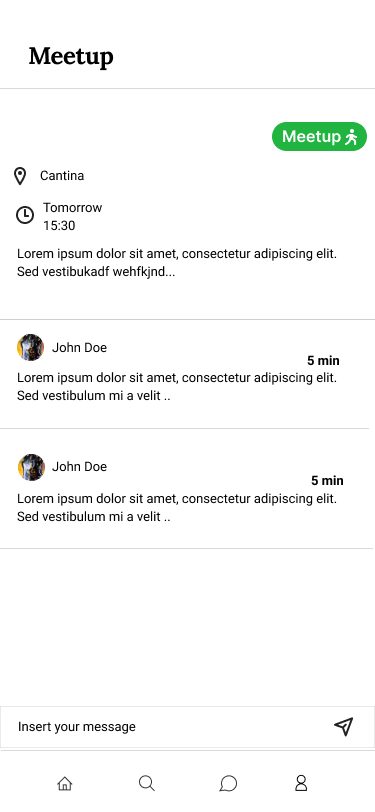

# Hamelin Flutters

## Confnect

- João Rocha
- João Romão
- Rafael Cristino
- Tiago Alves
- Xavier Pisco

<!--* TODO Adicionar o Why vision is important-->
## Product Vision

Connecting people through ideas, beyond the conference.

## Elevator Pitch

Our goal is to connect conference goers, helping them discuss and talk beyond the conference. By using our app, Confnect, the users will be added to different forums, depending on their interests and on the attended talks, encouraging them to ask questions, discuss and meet people with similar interests. The app includes many types of forums, including a sub-forum for each talk, in which the speaker can answer all the questions the attendees may have after the talk, and some main forums, separated by theme, where users can create their own discussions. Our product features an innovative functionality which will motivate attendees with similar interests to physically meet up, creating a more united conference.


<!--* Recomendar discussões baseadas nas palestras a que pessoa vai/foi, associando as discussões a interesses (tópicos genéricos) e depois recomendando as discussões sobre esses interesses. Podem ser também recomendados à pessoa outros participantes, que participem nas mesmas discussões ou tenham os mesmos interesses (vão à mesma palestra).
* Threads de dúvidas com o palestrante apenas com pessoas que foram à palestra
* O objetivo é causar uma conexão física, logo ao fim de algum tempo de discussão é sugerido um 'meet up'. E a discussão teria lá um botão de 'meet up' que quando fosse clicado criava tipo uma prompt para as pessoas que estão interessadas.
* Poderia fazer-se os dois, criar uma thread para cada palestra, de modo ao palestrante reponder, mas essa palestra tambem ser associada a um tema/interesse, onde as pessoas poderiam crias as suas proprias duvidas.

> Não podia estar organizado assim? (+rep)
    > |-aplicação
        > Sugestões
        > |- Tema da thread (AI, data science...)
            > |- Thread global
            > |- Diferentes palestras-->


## Requirements

### Use case diagram 


#### Post in questions

- **Actor**: Conference Atendee
- **Description**: This use case exists so that the atendees can upload their questions into the database to later be answered by the host of the talk
- Preconditions and Postconditions: In order to post a question the user must be enlisted in the respective talk and be logged in. The questions will be uploaded on the respective forum.
- **Normal Flow**:
    - The ateendee goes to the talk forum
    - The atendee presses the button to add a question to a forum
    - The atendee types his question
    - If it's within the allowed length, the system saves the question to the database, and displays it on the forum.
- **Alternative Flows and Exceptions**
    - The ateendee goes to the talk forum
    - The atendee presses the button to add a question to a forum
    - The atendee types his question
    - If the question is too long, the system does not allow to post the question


#### Post in discussion

- **Actor**: Conference Atendee
- **Description**: This use case exists so that the atendees can post discussions in different forums, so people are able to talk and discuss different themes.
- Preconditions and Postconditions: In order to like and dislike, the user must be a member of the current forum and be logged in. The vote cout will be updated 
- **Normal Flow**:
    - The ateendee goes to the talk forum
    - The atendee presses the button to add a new post to the forum
    - The atendee types his post
    - If it's within the allowed length, the system saves the post to the database, and displays it on the forum.
- **Alternative Flows and Exceptions**
    - The ateendee goes to the talk forum
    - The atendee presses the button to add a new post to the forum
    - The atendee types his post
    - If the post is too long, the system does not allow to post the question


#### Up/Downvote Questions

- **Actor**: Conference Atendee
- **Description**: This use case exists so that the questions are ordered by number of likes and to show the most relevant questions
- Preconditions and Postconditions: In order to post a question the user must be enlisted in the respective talk. The questions will be uploaded on the respective forum.
- **Normal Flow**:
- 
    - The atendee finds the post
    - The atendee presses the up/downvote question
    - The vote count is updated

#### Set up a meeting in real life
- **Actor**: Conference Atendee
- **Description**: This use case exists so that the atendees can meet other ateendes with similiar interests, if a discussion is particulary interesting the user can propose to meet up in real life, and the other users can either accept or deny the request.
- Preconditions and Postconditions: An ateendee must have participated in the discussion to propose a meeting. All the other member will recieve a notfication to meet up.
- **Normal Flow**:
    - The ateendee goes to the post
    - The atendee presses the button to add meetup in real life
    - The atendee answers the form on where and when the meeting will occur
    - The other members of the discussion will recieve a notification to go to the meetup
    - If the user participated in the discussion the other members will be notified of the meetup.
- **Alternative Flows and Exceptions**
    - The ateendee goes to the post
    - The atendee presses the button to add meetup in real life
    - If the atendee did not participate in the discussion, an error message appears.


#### Add, Edit and Delete a talk
- **Actor**: Administrator
- **Description**: This use case exists so that the Administrator is able to add the talks that the conference will have, and edit and deleted them if there is some alteration.
- Preconditions and Postconditions: The host has to be logged in and have admin privileges. The talk will be added, eddited or deleted from the database.
- **Normal Flow**:
    - The Admin chooses a talk
    - If the admin is logged in and has admin status, they can signall the system to add/remove/edit.
    - The system updates the database.
    
- **Alternative Flows and Exceptions**
    - The Admin chooses a talk
    - If they do not have the admin status, they wont be presented with the option to add/edit/delete the talk.

#### Pin answered questions
- **Actor**: Talk Host
- **Description**: This use case exists so talk hosts can flag questions as having received a satisfactory answer.
- Preconditions and Postconditions: The host has to be logged in, and if he pins the question, the question will be marked as answered. (E movida para outra pagina?)
- **Normal Flow**:
    - The host chooses a question
    - The host answers the question
    - He can press the button to pin the response
    - The response will be the first to appear and highlited
    

#### Delete a Question
- **Actor**: Host
- **Description**: This use case exists so that the Host of the talk is able to delete questions that are not relevant or inaproprite from their talk
- Preconditions and Postconditions: The user has to be the host of the respective talk. The question will then be removed from the database.
- **Normal Flow**:
    - If the Host is logged in and is the host of the talk, they can signall the system to delete it.
    - The system updates the database.
    
- **Alternative Flows and Exceptions**
    - The Host goes to the talk forum
    - If they do not have the host status in the talk, they wont be presented with the option to elete the question.


### User stories


#### Login Screen
<p>


</p>
As someone who is envolved in the conference, I want to be able to register in the app, so that I can use it.

    
##### Value and Effort
    - Value: Must have.
    - Effort: S

##### Acceptance Tests

```gherkin
Scenario: Registering in app
  Given There are 2 Users registered
  When I tap the "Register" button
  Then A form appears
  When the user fills the form correctly with a new username
  Then the user becomes registered and is redirected to the home page
  
Scenario: Registering in app
  Given There are 2 Users registered
  When I tap the "Register" button
  Then A form appears
  When the user fills the form correctly with an existin username
  Then an error message appears
  
Scenario: Registering in app
  Given There are 2 Users registered
  When I tap the "Register" button
  Then A form appears
  When the user fills the form incorrectly
  Then an error message appears
```

#### Register Screen

<p>


</p>

As someone who is registered in the app, I want to be able to login, so that I can use the app with my permissions.

##### Value and Effort
    -  Value: Must have.
    -  Effort: XS
##### Acceptance Tests

```gherkin
Scenario: Login
  Given There are 2 Users registered
  When I tap the "Login" button
  Then A form appears
  When the user fills the form correctly
  Then the user becomes Logged in and is redirected to the home page
  
  
Scenario: Login
  Given There are 2 Users registered
  When I tap the "Login" button
  Then A form appears
  When the user fills the form incorrectly
  Then a Error message appears
```

#### List Forums


As a conference atendee, I want to be able to see a list of interest/talk defined forums so that I can read the other attendees' interventions.
##### Value and Effort
    - Value: Must have
    - Effort: M
##### Acceptance Tests

```gherkin
Scenario: Seeing list of forums
  Given the user is in the home page
  When I tap the "Forums" button
  Then a List of forums appears
```

#### List Forums Posts


As a conference atendee, I want to be able to see a list of posts in a forum so that I know what is being discussed.
##### Value and Effort
    - Value: Must have
    - Effort: M
    
##### Acceptance Tests

```gherkin
Scenario: Seeing list of discussions
  Given the user is in the Forums page
  When I tap a specific forum
  Then a List of Discussions related to the forum appears
```

#### Profile Page


As an app user, I want to be able to see and edit my profile so that I know what info the app has about me, and change it if it's wrong.

##### Value and Effort
    - Value: Must have
    - Effort: M
##### Acceptance Tests
```gherkin
Scenario: Seeing my profile
  Given the user is in the home page
  When I tap the "Profile" button
  Then my profile appears
  
Scenario: Seeing my profile
  Given the user is his profile page
  When I tap the "Edit" button
  Then the user can change his personal info
  When the user updates his personal info correctly
  Then his profile is updated and he is redirected to his profile
  
Scenario: Seeing my profile
  Given the user is his profile page
  When I tap the "Edit" button
  Then the user can change his personal info
  When the user updates his personal info incorrectly
  Then an error appears and he is redirected to his profile
```


#### Create Posts in Forums


As a conference atendee, I want to be able to post in a forum, so that I can participate in the discussion and make new acquaintances.
##### Value and Effort
    - Value: Must have
    - Effort: S
##### Acceptance Tests

```gherkin
Scenario: Posting a discussion
  Given There are 3 posts in a forum
  When I tap the "add post" button
  And I submit the post with title and text
  Then There are 4 posts in the forum asked
  
Scenario: Posting a discussion
  Given There are 3 posts in a forum
  When I tap the "add post" button
  And I submit the post without title and/or text
  Then An error message appears
```

#### List Talks 


As an administrator, I want to be able to see the list of talks that we have, so that I have a global view of our app.
##### Value and Effort
    - Value: Must have
    - Effort: M
##### Acceptance Tests
```gherkin
Scenario: Seeing all talks
  Given the user is in the Talks page
  Then I can see all the talks and related buttons
```

#### Add Talks


As an administrator, I want to be able to add talks to the conference so that the app can have more talks.
##### Value and Effort
    - Value: Must have
    - Effort: M
##### Acceptance Tests
```gherkin
Scenario: Adding a talk
    Given There is 1 talk
    When An administrator clicks on "add talk" button
    And Submits a talk with title, tags, description, sepaker and image
    Then There are 2 talks
    
Scenario: Adding a talk
    Given There is 1 talk
    When An administrator clicks on "add talk" button
    And Submits a talk with an error
    Then An error message appears
```

#### Set Talk's Topics / Themes

<p>
</p>

As an administrator, I want to be able define a given talk's topics/themes, so that we can have a clear separation of interests.
##### Value and Effort
    - Value: Must have
    - Effort: M
##### Acceptance Tests
```gherkin
Scenario: The add talk page is opened
    Given There exists the tag "AI" in the database
    When An administrator clicks on "tags" field
    And Selects the tag "AI"
    Then That tag is added to the talk
    
Scenario: The add talk page is opened
    Given There are no tags in the database
    When An administrator clicks on the "tags" field
    And Starts typing a new tag name
    Then a "Add new tag" button appears
    
Scenario: The administrator starts typing on the "tags" and an "add new tag" button shows up on the screen
    Given There are not tags in the database
    When An administrator clicks on the "add new tag button"
    Then A new tag with the name that the administrator typed exists in the database
```

#### See Complete Post and it's Answers


As a conference attendee, I want to be able to see a complete post, so that I can see its answers and better participate in the discussion.
##### Value and Effort
    - Value: Must have
    - Effort: M
##### Acceptance Tests
```gherkin
Scenario: Viewing a post
    Given There are 3 posts on a talk
    When I click on 1 post
    Then I am redirected to the post page which has its answers
```


#### Edit Talks


As an administrator, I want to be able to edit a talk so that I can fix any mistake or update it.
##### Value and Effort
    - Value: Must have
    - Effort: M
##### Acceptance Tests
```gherkin
Scenario: Editing a talk
    Given There is 1 talk
    When An administrator clicks on "edit talk" button from 1 talk
    And Changes one or more parts 
    Then The talk is changed
```

#### Remove Talks


As an administrator, I want to be able to remove talks to the conference so that I can delete a talk that will not happen.
##### Value and Effort
    - Value: Must have
    - Effort: S
##### Acceptance Tests
```gherkin
Scenario: Removing a talk
    Given There are 2 talk
    When An administrator clicks on "remove talk" button from 1 talk
    And Confirms the deletion
    Then There is 1 talk

Scenario: Removing a talk
    Given There are 2 talk
    When An administrator clicks on "remove talk" button from 1 talk
    And Doesn't confirms the deletion
    Then There are 2 talk
```


#### Answer Posts / Questions


As a talk host, I want to be able to answer the posts/questions in the forums/talks so that i can clear up doubts the attendees still have.
##### Value and Effort
    - Value: Must have
    - Effort: M
##### Acceptance Tests
```gherkin
Scenario: Adding a comment
  Given Post A has 2 comments and I have the 'host' role
  When I tap the "add comment" button
  And I submit a comment "My answer is this"
  Then Post A has 3 comments
  And Post A contains a comment "My answer is this"
  And Post A contains a pinned comment "My answer is this"
```


#### Suggest Physical Meeting
<p>


</p>

As a conference attendee, when a discussion is gettting interesting, I want to be able to suggest a physical meeting with other attendees, so that meet them and expand my network.
    - Value: Must have
    - Effort: M
##### Acceptance Tests
```gherkin
Scenario: Creating a meetup
  Given Post A has no meetup in progress
  When I tap the "Meetup" button
  And I fill in the form with the meetup location, date, time and description
  Then Post A has a meetup in progress
  And The meetup has the details I inserted in the form
 
Scenario: Creating a meetup
  Given Post A has no meetup in progress
  When I tap the "Meetup" button
  And I don't fill in the form correctly
  Then Post A has no meetup in progress
  And An error message appears
```

#### Comment on a Physical Meeting



As a conference attendee, interested in participating in a meetup, I want to be able to comment on a meetup, so that all the goers can agree on the details.

##### Value and Effort
    - Value: Must have
    - Effort: S
##### Acceptance Tests
```gherkin
Scenario: In the Meetup page, adding a comment
  Given The Meetup has no comments
  When I tap the "add comment" button
  And I submit a comment "My answer is this"
  Then The Meetup has one comment
  And The Meetup contains a comment "My answer is this"
```

#### Edit a Physical Meeting


As a conference attendee, interested in participating in a meetup, I want to be able to edit the meetup I created, so that I can accommodate any request by the other attendees.

##### Value and Effort
    - Value: Must have
    - Effort: S
##### Acceptance Tests
```gherkin
Scenario: Editing the meetup
    Given There is 1 meetup and I am the meetup creator
    When I click on the "edit meetup" button
    And Change one or more details 
    Then The meetup details are changed accordingly
Scenario: Editing the meetup
    Given There is 1 meetup and I am the meetup creator
    When I click on the "edit meetup" button
    And Fill the form incorrectly
    Then The meetup details are not changes
    And An error occurs
```

#### Cancel a Physical Meeting


As a conference attendee, I want to be able to comment on a meetup that was unsuccessful, so that the post page is consistent.

##### Value and Effort
    - Value: Must have
    - Effort: S
##### Acceptance Tests
```gherkin
Scenario: In the Post page
  Given There is 1 meetup and I am the meetup creator
  When I tap the "delete meetup" button
  And I Give confirmation
  Then There is no meetups
Scenario: In the Post page
  Given There is 1 meetup and I am the meetup creator
  When I tap the "delete meetup" button
  And I don't Give confirmation
  Then There is 1 meetup
```

#### Search Page


As an app user, I want to search for a specific forum, post or user, so that I can easily find what I'm looking for.

##### Value and Effort
    - Value: Must have
    - Effort: M 
##### Acceptance Tests
```gherkin
Scenario: In the Search page
    Given There exists many forums, users and posts
    When I write something in the "search field"
    Then The forums, users and posts that resemble what I wrote the most show up
```


#### Interest-based Post / Forum Suggestions
    
As a conference attendee, I want to easily find topics that interest me, so that I don't waste my time searching for them.
##### Value and Effort
    - Value: Could have
    - Effort: M
##### Acceptance Tests
```gherkin
    TODO
```


#### Main Page


As an attendee, I want to have a page that shows me the posts and forums that really matter to me, so that I can have a positive experience with the app.
##### Value and Effort
    - Value: Must have
    - Effort: M
##### Acceptance Tests

```gherkin
    TODO
```


#### Generate Forums From Talks
*Note: this is made automatically whenever a talk is added, so there is no mockup*<br/>
As an administrator, I want the forums to be generated based on the talks and the talks' themes so that we can have organized forums, one for each theme/interest and one for each talk (for questions).
##### Value and Effort
    - Value: Must have
    - Effort: S
##### Acceptance Tests
```gherkin
    TODO
```

#### Remove Questions / Answers

As a talk host, I want to be able to remove inappropriate questions / wrong answers so that we can have an healthy forum.
##### Value and Effort
    - Value: Must have.
    - Effort: S
##### Acceptance Tests
```gherkin
    TODO
```

#### Pin Answered Questions

As a talk host, I want to be able to pin answered questions so that the question forum is organized and it is easy to find the answers to answered questions.
##### Value and Effort
    - Value: Could have
    - Effort: S
##### Acceptance Tests
```gherkin
    TODO
```

#### Generate Register Codes

As an administrator, I want to be able to generate codes for hosts and attendees to insert when they register, so that we can control who we let in (only people who participate in the conference) and what permissions they have (attendee or host).
##### Value and Effort
    - Value: Could have
    - Effort: M
##### Acceptance Tests
```gherkin
    TODO
```

#### Multiple Conference Support

As an administrator, I want to be able to reuse the app with other conferences, so that we take good value from the investment.

##### Value and Effort
    - Value: Could Have
    - Effort: M
##### Acceptance Tests
```gherkin
    TODO
```


### Domain model


---

## Architecture and Design


### Logical architecture


### Physical architecture


---

## Implementation

### Product increment #1

For this iteration we implemented the [login](#login-screen), [register](#register-screen) and [forum list](#list-forums) pages. <br/>Release: [v0.1](https://github.com/FEUP-ESOF-2020-21/open-cx-t7g2-hamelin-flutters/releases/tag/v0.1).

### Product increment #2

For this iteration we implemented:
- [List forum posts](#list-forums-posts)
- [List talks](#list-talks)
- [Add talks](#add-talks)
- [Set talk's topics/themes](#set-talks-topics--themes)
- [Create posts in forums](#create-posts-in-forums)
- [Remove talks](#remove-talks)
- [See complete post and its answers](#see-complete-posts-and-its-answers)
- [Answer posts / Questions](#answer-posts--questions)

Release: [v0.2](https://github.com/FEUP-ESOF-2020-21/open-cx-t7g2-hamelin-flutters/releases/tag/v0.2).

### Product increment #3

For this iteration we implemented:
- [Profile Page](#profile-page)
- [Edit talks](#edit-talks)
- [Host answers posts/questions and has answer pinned](#answer-posts--questions)
- [Suggest Physical Meeting](#suggest-physical-meeting)
- [Comment on a Physical Meeting](#comment-on-a-physical-meeting)
- [Search page](#search-page)
- [Interest-based Post / Forum Suggestions](#interest-based-post--forum-suggestions)
- [Main Page](#main-page)
- [Generate Forums From Talks](#generate-forums-from-talks)

Release: [v0.3](https://github.com/FEUP-ESOF-2020-21/open-cx-t7g2-hamelin-flutters/releases/tag/v0.3).

---
## Test

 


---
## Configuration and change management

[GitHub flow](https://guides.github.com/introduction/flow/).


---

## Project management


---

## Evolution - contributions to open-cx

